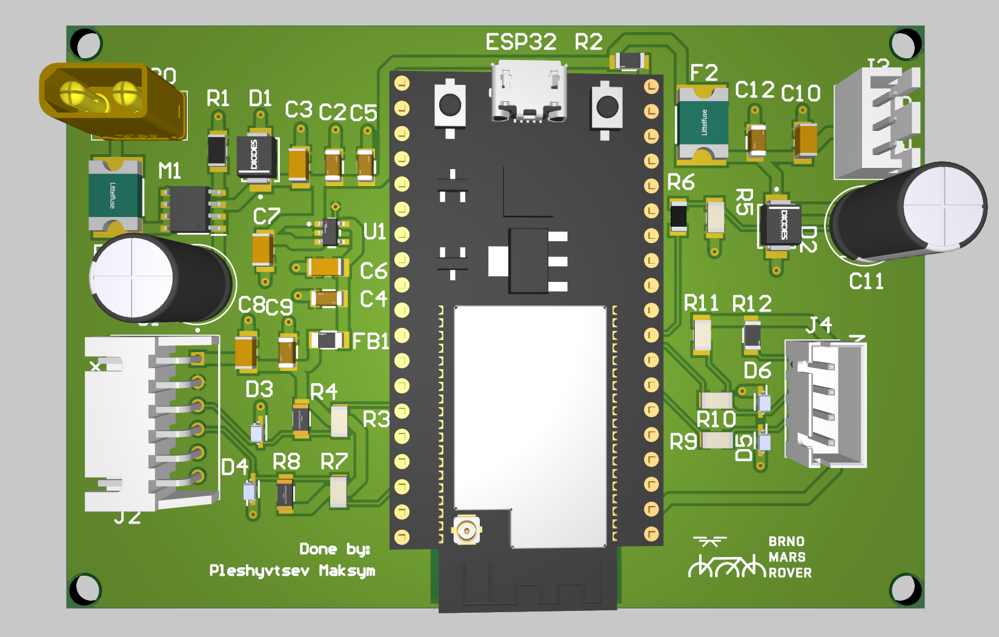
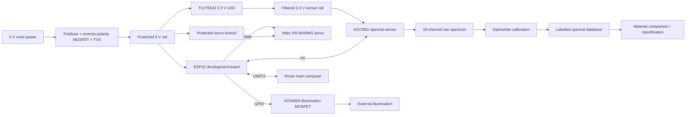
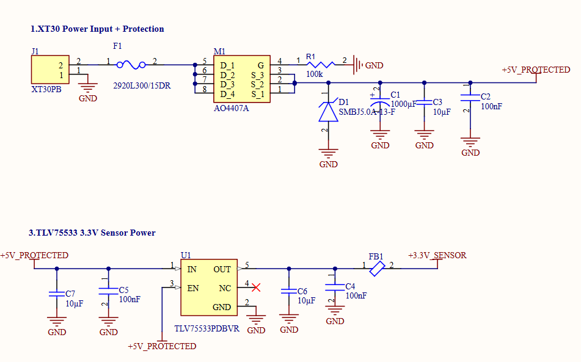
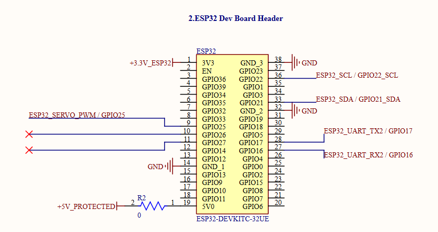
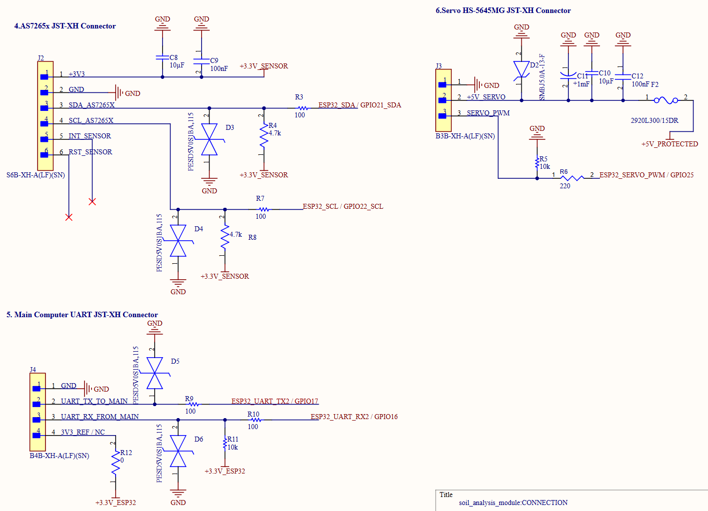
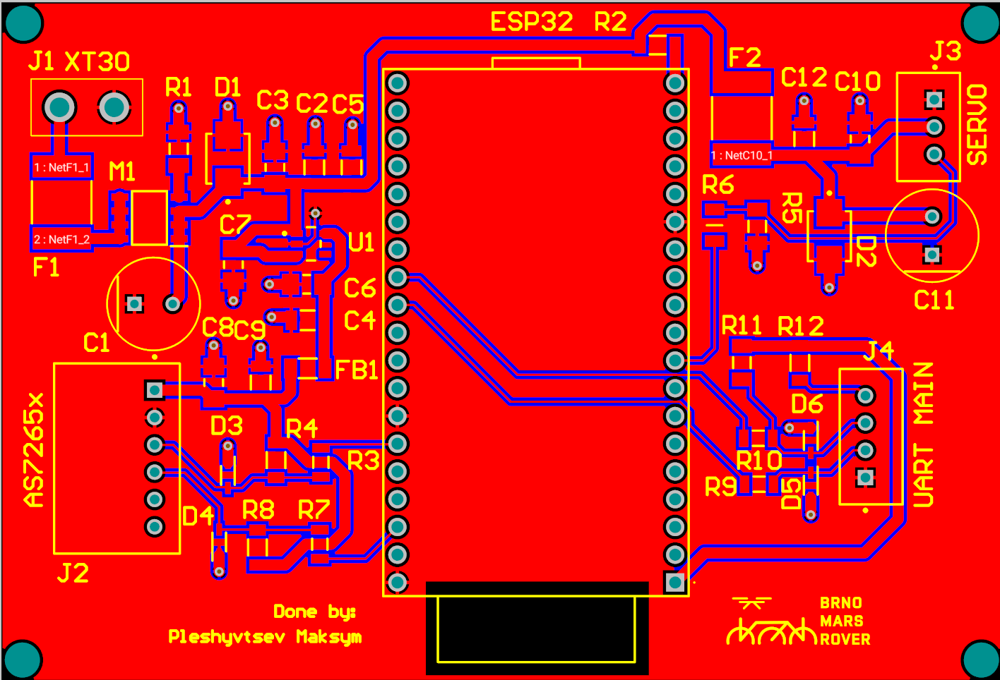
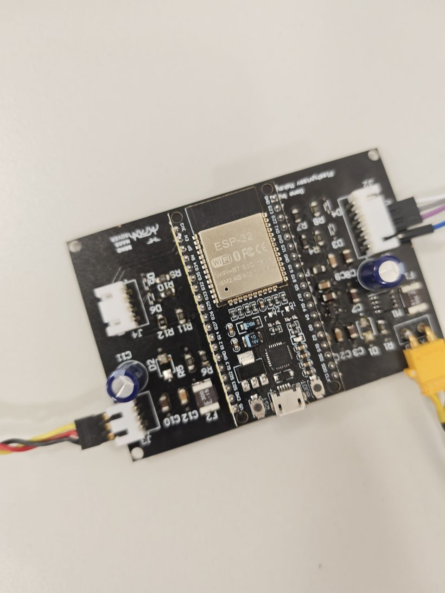

# AS7265x Soil Analysis Module

> Multispectral soil-analysis payload for the **Brno Mars Rover / Freya** science subsystem.


<p align="center">
  
</p>

## Overview

This repository contains the hardware, firmware, documentation, test data, and development notes for a rover-mounted multispectral soil-analysis module built around the **AS7265x 18-channel VIS-NIR spectral sensor**.

The system is intended to:

- acquire repeatable 18-channel spectra from soil, mineral, salt, clay, and organic analog samples;
- control the sample-analysis mechanism and illumination;
- communicate measurement results to the rover main computer;
- build a labelled spectral database for material comparison and classification;
- provide a practical science payload for field operation and Mars-rover competitions.

The first hardware version is a custom **carrier/interface PCB**. The AS7265x sensor, ESP32 development board, servo, and illumination source are external modules connected to the PCB.

> [!IMPORTANT]
> **V1.0 is a development prototype, not a production-ready board.**  
> The sensor and servo have been operated successfully in USB-powered tests, but full operation from the rover 5 V supply, the servo power branch, UART interface, and illumination channel are still being validated.

---

## Main Features

- **AS7265x multispectral sensing**
  - 18 channels from approximately **410 nm to 940 nm**
  - suitable for comparative reflectance measurements in the visible and near-infrared range

- **ESP32-based control**
  - IoT ESP-WROOM-32 development board with CP2102
  - USB programming and debugging
  - I²C sensor interface
  - UART connection to the rover computer
  - PWM servo control

- **Protected 5 V input**
  - XT30 PCB connector
  - resettable polyfuse
  - reverse-polarity protection
  - TVS surge suppression
  - bulk and local decoupling

- **Protected sensor supply**
  - TLV75533 3.3 V LDO
  - ferrite-bead filtering
  - local 10 µF and 100 nF decoupling

- **External interfaces**
  - AS7265x: JST-XH 6-pin
  - rover UART: JST-XH 4-pin
  - servo: JST-XH 3-pin
  - external illumination control through an AO3400A low-side MOSFET

- **Prototype-friendly assembly**
  - 1206 passives where practical
  - through-hole power and cable connectors
  - mounting holes
  - two-layer PCB with a ground plane

- **Science database workflow**
  - pure reference chemicals
  - Martian geological analogs
  - terrestrial soils and minerals
  - contamination and organic false-positive references

---

## System Architecture



---

## Spectral Channels

The AS7265x triad measures the following nominal wavelengths:

| Channel | Wavelength | Channel | Wavelength | Channel | Wavelength |
|---|---:|---|---:|---|---:|
| A | 410 nm | G | 560 nm | R | 730 nm |
| B | 435 nm | H | 585 nm | S | 760 nm |
| C | 460 nm | I | 610 nm | T | 810 nm |
| D | 485 nm | J | 645 nm | U | 860 nm |
| E | 510 nm | K | 680 nm | V | 900 nm |
| F | 535 nm | L | 705 nm | W | 940 nm |

The module is intended for **comparative spectral analysis**, not laboratory-grade chemical identification.

Reliable classification requires controlled illumination, geometry, sample preparation, calibration, and a representative database.

---

## Hardware

### Main Components

| Function | Selected component | Notes |
|---|---|---|
| Controller | IoT ESP-WROOM-32 development board with CP2102 | Mounted on female headers; the bare ESP32 module is not routed directly on the carrier PCB |
| Spectral sensor | AS7265x 18-channel multispectral triad | External module connected by cable |
| Servo | Hitec HS-5645MG | External sample-mechanism actuator |
| Sensor LDO | TLV75533PDBVR | Protected 3.3 V sensor rail |
| Reverse-polarity protection | AO4407A | P-channel MOSFET in SO-8 |
| Main and servo fuses | Littelfuse 2920L300/15DR | Resettable 3 A hold / 5 A trip polyfuses |
| Input and servo TVS | SMBJ5.0A-13-F | 5 V unidirectional TVS |
| Sensor filtering | BLM31PG121SN1L | 120 Ω at 100 MHz ferrite bead |
| Illumination switch | AO3400A | N-channel low-side MOSFET |
| Signal ESD | PESD5V0S1BA,115 | Optional protection on external digital lines |
| Main input | XT30PB | Nominal 5 V input |
| External connectors | JST-XH | Sensor, UART, servo, and auxiliary interfaces |
| Small passives | 1206 | Selected for easier hand assembly |

### Power Architecture

```text
XT30 5 V input
 └─ Main polyfuse
    └─ AO4407A reverse-polarity protection
       └─ +5V_PROTECTED
          ├─ ESP32 5 V / VIN
          ├─ Servo branch
          │  ├─ Servo polyfuse
          │  ├─ TVS diode
          │  └─ 1000 µF + 10 µF + 100 nF
          ├─ TLV75533 3.3 V LDO
          │  └─ Ferrite bead → +3V3_SENSOR
          └─ Illumination branch
```

> [!CAUTION]
> The carrier PCB is designed for a **nominal 5 V input**.  
> Do **not** connect it directly to 12 V, 24 V, 30 V, or an unregulated rover battery rail.

---

## Connector Interfaces

### AS7265x Sensor Connector — JST-XH 6-pin

| Signal | Description |
|---|---|
| `+3V3_SENSOR` | Filtered 3.3 V sensor supply |
| `GND` | Ground |
| `ESP32_SDA / GPIO21_SDA` | I²C data |
| `ESP32_SCL / GPIO22_SCL` | I²C clock |
| `AS7265X_INT` | Sensor interrupt |
| `AS7265X_RST` | Sensor reset |

The SDA and SCL lines include series resistors.

Optional 4.7 kΩ pull-ups and ESD protection positions are provided.

### Rover Main-Computer UART — JST-XH 4-pin

| Signal | ESP32 signal | Description |
|---|---|---|
| `GND` | GND | Common ground |
| `UART2_TX` | GPIO17 | ESP32 transmit |
| `UART2_RX` | GPIO16 | ESP32 receive |
| `3V3_REF` | 3.3 V reference | Logic-level reference only |

The UART interface is **3.3 V logic** and is not RS-232 tolerant.

### Servo Connector — JST-XH 3-pin

| Signal | Description |
|---|---|
| `+5V_SERVO` | Protected servo supply |
| `GND` | Servo ground |
| `SERVO_PWM` | ESP32 PWM control |

The servo branch has a dedicated resettable fuse, TVS diode, and local bulk capacitance.

---

## PCB V1.0

The first PCB revision is a two-layer carrier board with:

- bottom ground copper plane;
- top-side signal and power routing;
- separate protected sensor and servo branches;
- mounting holes;
- 1206 passives for manual assembly;
- external modules connected through JST-XH;
- ESP32 development board mounted on female headers.

### V1.0 Image Set

| Power section | ESP32 section |
|---|---|
|  |  |

| External connections | 2D PCB |
|---|---|
|  |  |

| 3D PCB | Assembled prototype |
|---|---|
|  |  |

---

## Current Development Status

### Completed

- system architecture defined;
- V1.0 schematic and PCB layout completed;
- design-rule checks completed before fabrication;
- mounting holes and ground copper added;
- V1.0 PCB manufactured and assembled;
- AS7265x communication tested;
- servo movement tested;
- MicroPython control workflow tested through USB;
- initial white-reference measurements collected;
- material sourcing plan and spectral database prepared;
- pure chemicals and geological analog targets selected.

### In Validation

- stable operation from the rover 5 V power input;
- servo branch behaviour under load;
- power sequencing and voltage drops;
- illumination MOSFET channel;
- rover UART interface;
- simultaneous operation of sensor, servo, LED, and serial communication;
- repeatability versus sensor-to-sample distance;
- mechanical integration with the sample box.

### Known V1.0 Limitations

- the power subsystem is still being debugged and must be tested with a current-limited bench supply;
- servo current spikes can disturb the 5 V rail if power distribution or bulk capacitance is insufficient;
- the AS7265x result depends on illumination, distance, sample height, surface shape, grain size, moisture, and compaction;
- mass is not required for the current task, but it can become useful metadata for future experiments;
- the current board does not yet integrate a distance sensor or load-cell front end;
- the system is not a replacement for Raman, XRF, FTIR, or laboratory chemical analysis.

---

## Firmware

The current prototype uses an ESP32 and a MicroPython-based test workflow.

Typical responsibilities:

- initialize the I²C bus;
- configure the AS7265x;
- control illumination;
- acquire all 18 spectral channels;
- move the servo to defined positions;
- perform white and dark reference measurements;
- normalize and package the data;
- send results to the rover computer through UART;
- store local test output during bench validation.

### Example Test Command

```powershell
mpremote connect COM3 exec "import auto_main"
```

Replace `COM3` with the actual ESP32 serial port.

> The exact file-upload command depends on the current firmware structure. Check the firmware directory before copying or replacing files on the ESP32.

### Recommended Firmware Structure

```text
Firmware/
├─ boot.py
├─ main.py
├─ auto_main.py
├─ as7265x.py
├─ servo_control.py
├─ illumination.py
├─ uart_protocol.py
├─ calibration.py
└─ config.py
```

---

## Bench Bring-Up Procedure

Use the following order after assembling or modifying the PCB.

### 1. Visual Inspection

Check:

- IC orientation;
- diode polarity;
- electrolytic capacitor polarity;
- MOSFET orientation;
- solder bridges;
- incomplete joints;
- damaged pads or tracks;
- connector pin numbering.

### 2. Unpowered Resistance Checks

Before connecting power:

- measure resistance between `+5V_PROTECTED` and `GND`;
- measure resistance between `+3V3_SENSOR` and `GND`;
- verify that no external cable swaps power and ground;
- check that the TVS diode is not installed backwards or shorted;
- confirm continuity from XT30 ground to all connector grounds.

### 3. USB-Only Test

With the rover 5 V input disconnected:

1. connect the ESP32 through USB;
2. verify that the ESP32 enumerates correctly;
3. run an I²C scan;
4. connect the AS7265x;
5. confirm sensor detection and channel readout;
6. test the servo only after confirming the supply path being used is safe.

### 4. External 5 V Test Without Servo

1. disconnect the servo;
2. set the bench supply to **5.0 V**;
3. use a conservative current limit;
4. connect the XT30 input;
5. verify:
   - `+5V_PROTECTED`;
   - ESP32 VIN/5 V;
   - LDO input;
   - `+3V3_SENSOR`;
6. monitor current and component temperature.

### 5. Servo Branch Test

1. keep the sensor disconnected initially;
2. connect the servo;
3. command only small, slow movements;
4. observe the 5 V rail with a multimeter or oscilloscope;
5. check for resets, voltage collapse, or excessive current;
6. test simultaneous sensor acquisition only after the servo branch is stable.

### 6. Full System Test

Validate:

- sensor acquisition;
- servo movement;
- illumination switching;
- UART communication;
- repeatability over multiple scans;
- operation from the intended rover power source.

---

## Measurement and Calibration Workflow

### Recommended Scan Sequence

1. warm up the electronics and illumination;
2. record a dark measurement;
3. record a white reference using PTFE or another stable white target;
4. place and level the sample;
5. record distance and optional mass;
6. acquire several repeated scans;
7. reject saturated or incomplete scans;
8. calculate normalized reflectance;
9. save raw data, calibrated data, and metadata;
10. clean the sample cup before the next material.

A common per-channel normalization is:

```text
Reflectance[i] = (Sample[i] - Dark[i]) / (White[i] - Dark[i])
```

The denominator must be checked to avoid division by zero or unstable channels.

### Variables That Must Be Controlled

- sensor-to-sample distance;
- illumination intensity and angle;
- integration time;
- sensor gain;
- sample-cup geometry;
- sample fill level;
- grain size;
- moisture;
- compaction;
- ambient light;
- sensor and LED temperature;
- contamination from previous samples.

---

## Sample Preparation Protocol

For repeatable database generation:

1. **Grain size**

   Crush rocks, crystals, and hard materials to a fine and reasonably uniform powder where safe and practical.

   The target used in the project documentation is below approximately **150 µm**.

2. **Drying**

   Dry geological samples before scanning.

   A reference preparation method is **90 °C for 2 hours** for suitable soils, sands, and clays.

   Do not heat plastics, volatile organics, or unknown chemicals.

3. **Compaction**

   Fill the sample cup and level the surface.

   Do not over-compress the sample.

4. **Labelling**

   Store both the material name and preparation method, for example:

   ```text
   Quartz_Sand_Fine_Baked
   Iron_Oxide_Red_Dry
   Bentonite_Fine_Ambient
   ```

5. **Replicates**

   Take multiple scans after removing and replacing the sample.

   This captures placement variation rather than only electronic noise.

---

## Spectral Material Database

The project database is designed to cover four groups.

### 1. Martian and Geological Markers

Examples:

- iron(III) oxide;
- iron(II,III) oxide;
- iron(II) sulfate;
- magnesium sulfate;
- calcium carbonate;
- magnesium carbonate;
- gypsum;
- sulfur;
- kaolin;
- bentonite / smectite;
- illite and iron-bearing clays;
- quartz sand;
- dolomite;
- granite and volcanic analog materials.

### 2. Optical Calibration Extremes

Examples:

- PTFE white reference;
- magnesium oxide;
- calcium carbonate;
- activated carbon;
- dark iron oxide;
- stable bright and dark powders.

### 3. Terrestrial Background and False Positives

Examples:

- potting soil;
- river sand;
- peat;
- fertilizer;
- cement;
- marble dust;
- perlite;
- mixed construction minerals.

### 4. Organic and Contamination References

Examples:

- ascorbic acid;
- citric acid;
- tartaric acid;
- cornstarch;
- PET plastic;
- wood ash;
- rover hardware contamination targets.

The database is intended for **training and validating a classification model**, not for claiming definitive chemical identification from one spectrum.

### Recommended Dataset Record

```csv
timestamp,sample_id,material,preparation,distance_mm,mass_g,
integration_time,gain,temperature_c,
ch_410,ch_435,ch_460,ch_485,ch_510,ch_535,
ch_560,ch_585,ch_610,ch_645,ch_680,ch_705,
ch_730,ch_760,ch_810,ch_860,ch_900,ch_940
```

Recommended storage:

```text
Data/
├─ raw/
├─ calibrated/
├─ references/
│  ├─ dark/
│  └─ white/
├─ metadata.csv
└─ plots/
```

---

## Repository Structure

```text
as7265x-soil-analysis-module/
├─ README.md
├─ Photos/
│  └─ VER1.0/
│     ├─ 01_POWER_ver1,0.png
│     ├─ 02_ESP32_ver1,0.png
│     ├─ 03_CONNECTION_ver1,0.png
│     ├─ 2D_PCB_ver1,0.png
│     ├─ 3D_PCB_ver1,0.png
│     └─ PCB_photo_ver1,0.jpg
├─ Hardware/
│  ├─ Altium/
│  ├─ Gerbers/
│  ├─ BOM/
│  └─ Manufacturing/
├─ Firmware/
├─ Data/
├─ Documentation/
└─ Tests/
```

The exact folder names may be adjusted as the repository is reorganized.

Keep released manufacturing outputs separated by hardware version.

Recommended release structure:

```text
Hardware/Releases/
├─ V1.0/
│  ├─ Gerbers/
│  ├─ Drill/
│  ├─ BOM/
│  ├─ PickAndPlace/
│  └─ PDF/
└─ V1.1/
```

---

## Project Documentation

Recommended documentation files:

- `Mars Rover AS7265x Soil Analyzer PCB - BOM _ Component Models v0.1.pdf`
- `Purchase List - Mars Rover AS7265x PCB.docx`
- `Spectral Material Database.docx`

Place them in the `Documentation/` directory and update the links below if the filenames change:

- [BOM and component models](Documentation/Mars%20Rover%20AS7265x%20Soil%20Analyzer%20PCB%20-%20BOM%20_%20Component%20Models%20v0.1.pdf)
- [Purchase list](Documentation/Purchase%20List%20-%20Mars%20Rover%20AS7265x%20PCB.docx)
- [Spectral material database](Documentation/Spectral%20Material%20Database.docx)

---

## Planned V1.1 Improvements

The next PCB and system revision is expected to focus on:

- adding a **time-of-flight distance sensor**, currently planned around the VL53L4CD;
- recording sample height and sensor-to-sample distance for every spectrum;
- adding support for a **load cell** as optional metadata;
- validating an external HX711 module before deciding whether to integrate the analog front end;
- considering NAU7802 integration after the load-cell concept is proven;
- improving servo and logic power separation;
- improving power integrity and bulk-capacitor placement;
- adding clearer test points for all power rails;
- reviewing TVS components and protection footprints;
- improving connector labels and cable-keying documentation;
- adding a more complete rover UART protocol;
- expanding calibration, automated scan sequencing, and data logging;
- creating a mechanical enclosure and controlled optical chamber;
- adding versioned manufacturing outputs and validation reports.

---

## Long-Term Direction

After the current competition-ready module is stable, possible research extensions include:

- a larger multisensor science payload;
- improved VIS-NIR classification using distance and geometry compensation;
- controlled fluorescence experiments;
- a SHERLOC-inspired student research module combining complementary optical methods;
- a more advanced optical head, sample imaging, and onboard scientific decision support.

These are future research directions and are outside the validated scope of PCB V1.0.

---

## Safety

- Use only the intended 5 V supply.
- Use a current-limited bench supply during first power-up.
- Do not touch or reconnect the board while the servo is moving.
- Disconnect power before changing sensor, servo, or UART wiring.
- Verify the polarity of TVS diodes and electrolytic capacitors.
- Avoid inhaling fine powders.
- Wear eye protection, gloves, and suitable respiratory protection when preparing samples.
- Review the SDS for every chemical.
- Keep oxidizers, organics, acids, salts, and unknown mixtures separated.
- Do not heat plastics, volatile substances, nitrates, or unknown materials.
- Use dedicated tools and clean the sample holder between materials.

---

## Contributing

Development is currently focused on the Brno Mars Rover science subsystem.

Useful contributions include:

- schematic and PCB review;
- ESP32 firmware;
- AS7265x driver improvements;
- calibration and data-processing scripts;
- repeatability studies;
- test fixtures;
- dataset tooling;
- mechanical and optical-chamber design;
- documentation and validation reports.

For hardware changes, open an issue or pull request describing:

1. the problem;
2. the proposed change;
3. affected schematic blocks or PCB nets;
4. validation method;
5. compatibility with the current hardware revision.

---

## Versioning

Suggested version naming:

- `V1.0` — first manufactured and assembled carrier PCB;
- `V1.1` — power, interface, distance, and testability improvements;
- `V2.0` — major architecture change or integrated science-sensor expansion.

Tag firmware and datasets separately when their versions do not match the PCB revision.

---

## License

No open-source license has been selected yet.

Until a `LICENSE` file is added, the repository should be treated as **all rights reserved**.

---

## Acknowledgements

Developed as part of the **Brno Mars Rover / Freya** student rover project, with the goal of building a practical, field-testable science payload for multispectral soil and material analysis.
