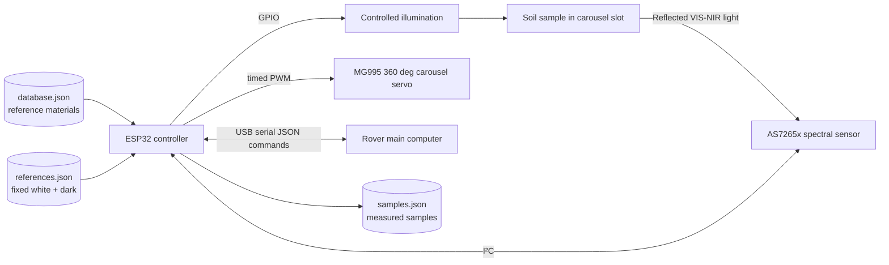

# AS7265x Soil Analysis Module

> Competition-ready multispectral soil-analysis payload developed for the **Brno Mars Rover / Freya** science subsystem.


<p align="center">
  
</p>

---

## Overview

The **AS7265x Soil Analysis Module** is a rover-mounted scientific payload designed for multispectral analysis of soils, minerals, salts, clays, and organic reference materials.

The system uses the **AS7265x 18-channel VIS-NIR spectral sensor** to measure reflected light between approximately **410 nm and 940 nm**. An ESP32 controls the sensor, the eight-slot sample carousel, illumination, and the calibration pipeline.

The ESP32 is a **passive command-controlled instrument**. It performs no automatic movement and no automatic measurement: the main computer is the mission controller and issues one JSON command at a time over the USB serial link. All scientific sample data is stored persistently on the ESP32 itself.

The project combines:

- custom PCB design;
- protected power distribution;
- embedded control;
- multispectral data acquisition;
- calibration and measurement methodology;
- spectral database development;
- mechanical and rover-system integration.

The current PCB V1.0 provides the core functionality required for the competition while remaining open to future sensor and hardware improvements.

---

## Engineering Scope

The project was developed from system concept to an assembled and operational hardware platform.

The engineering work includes:

- defining the overall science-module architecture;
- selecting the sensor, controller, actuator, connectors, and protection components;
- designing the complete schematic in Altium Designer;
- creating a custom two-layer carrier PCB;
- designing protected 5 V and 3.3 V power branches;
- integrating I²C, UART, PWM, and illumination interfaces;
- preparing the component BOM and purchasing documentation;
- assembling and debugging the first PCB revision;
- developing ESP32 firmware for sensor and servo control;
- creating a structured spectral material database;
- defining calibration and sample-preparation procedures;
- preparing the system for mechanical integration with the Freya rover.

---

## System Operation

The module is command-driven. Nothing moves and nothing is measured until the rover main computer asks for it.

1. The operator aligns physical Slot 1 with the loading hole and confirms it (`sync_position`).
2. `select_slot` brings the next slot to the loading hole, normally one 45 deg clockwise step.
3. `prepare_load` assigns a Sample ID and science metadata to that slot.
4. The external rover arm deposits soil; `confirm_loaded` records that it happened.
5. `measure_sample` rotates the same physical slot to the scanner, settles, and acquires one 18-channel spectrum.
6. The spectrum is corrected with the **fixed** stored dark and white references.
7. The normalized spectrum is compared against **every** material in the reference database.
8. An automatic, deliberately conservative interpretation is generated.
9. The complete scientific record is written to ESP32 flash and returned to the PC.


```mermaid
flowchart LR
    SAMPLE[Soil sample in carousel slot]
    LIGHT[Controlled illumination]
    SENSOR[AS7265x spectral sensor]
    ESP[ESP32 controller]
    SERVO[MG995 360 deg carousel servo]
    ROVER[Rover main computer]
    DATABASE[(database.json<br/>reference materials)]
    REFS[(references.json<br/>fixed white + dark)]
    STORE[(samples.json<br/>measured samples)]

    ESP -->|GPIO| LIGHT
    LIGHT --> SAMPLE
    SAMPLE -->|Reflected VIS-NIR light| SENSOR
    ESP <-->|I²C| SENSOR
    ESP -->|timed PWM| SERVO
    ESP <-->|USB serial JSON commands| ROVER
    DATABASE --> ESP
    REFS --> ESP
    ESP --> STORE
```

---

## Sample Carousel

The sample mechanism is a full 360° carousel driven by an **MG995 modified for continuous rotation**. It has no encoder, no Hall sensor and no position feedback of any kind; position is tracked entirely in software.

| Property | Value |
|---|---|
| Physical sample slots | 8 |
| Angle between neighbouring slot centres | 360° / 8 = **45°** |
| Scanning position ↔ loading position | **180°**, i.e. **4 slots** apart |

Because the two fixed positions are exactly opposite, the slot at the loader follows directly from the slot at the scanner:

```text
load_slot = ((scan_slot - 1 + 4) % 8) + 1
```

The relationship is its own inverse and holds in both directions: putting Slot 3 at the loader necessarily puts Slot 7 at the scanner, and Slot 1 at the loader means Slot 5 at the scanner.

Slots are numbered **1–8 clockwise**, and the origin is established by the operator: physical Slot 1 is aligned with the **soil loading hole** and declared as Slot 1.

```text
Slot 1 = loading position (the calibrated origin)
Slot 2 = 45°  clockwise from Slot 1
...
Slot 8 = 315° clockwise from Slot 1
```

### Software position tracking

There is no sensor to ask, so after every reset:

```python
position_valid = False
current_scan_slot = None
selected_slot = None
```

Synchronization is the **first** operation after boot. The operator moves the carousel with whole-slot and degree commands until Slot 1 sits under the loading hole, then confirms it:

```json
{"cmd": "sync_position", "load_slot": 1}
```

`sync_position` never moves anything — it records where the operator has already put the mechanism. Because the scanner is exactly 180° opposite, declaring Slot 1 at the loader also declares **Slot 5 at the scanner**.

From then on the firmware maintains position by counting calibrated slot transitions. If a movement fails, the tracked position is **discarded** rather than guessed, and the operator must re-synchronize.

### Three separate position concepts

These are deliberately kept apart:

| Concept | Meaning |
|---|---|
| `current_load_slot` | Which slot is physically under the loading hole |
| `current_scan_slot` | Which slot is physically under the scanner |
| `selected_slot` | Which slot the operator is working with |

While soil is deposited the selected slot sits at the loader. After `measure_sample` the carousel has swung 180°, so the **same** selected slot now sits at the scanner instead.

### Choosing a slot

`select_slot` brings the chosen slot to the loading hole. Sequential progression is always one clockwise step, because any move of four slots or fewer resolves in the forward (clockwise) direction:

```text
Slot 1 -> Slot 2   = one clockwise slot transition
Slot 2 -> Slot 3   = one clockwise slot transition
Slot 8 -> Slot 1   = one clockwise slot transition
```

Each transition spans 45° of geometry but is *commanded* with the calibrated ~40° equivalent — see below.

Selecting a distant slot still takes the shortest path.

### Movement calibration: geometry vs servo command

The single most important distinction in the carousel code:

| | |
|---|---|
| **Geometry** | what the carousel *is* — 45° slot spacing, 180° loader↔scanner |
| **Calibration** | what the servo must be *commanded* to do |

These are not the same, and one is never derived from the other. A continuous-rotation servo has acceleration, backlash and load-dependent speed, so the command that actually lands a slot correctly is not "45° worth of runtime". Hardware testing showed a full 45° command **overshoots** the next slot; the effective command is closer to **40°**.

Each movement type therefore has its own independent calibration:

| Movement | Constants | Notes |
|---|---|---|
| Adjacent slot CW (N → N+1) | `NEXT_SLOT_CW_MS` | Effective ≈ **40°** |
| Adjacent slot CCW (N → N−1) | `NEXT_SLOT_CCW_MS` | Effective ≈ **45°** |
| Half turn (loader ↔ scanner) | `LOAD_TO_SCAN_CW_MS` / `SCAN_TO_LOAD_CCW_MS` | **Independent** — never 4 × adjacent |
| Fine alignment | `CW_MS_PER_DEGREE` / `CCW_MS_PER_DEGREE` | Small corrections only |

> [!IMPORTANT]
> **The two directions are not symmetric.** Measured on the real mechanism: a ~40° command lands the next slot correctly going clockwise, but the *same* command stops about 5° short coming back counter-clockwise, which needs ~45°. Backlash and servo asymmetry both contribute. Never share one calibration between directions — including for fine alignment.

> [!IMPORTANT]
> The half turn is **not** four adjacent-slot moves. Four adjacent commands total roughly 4 × 40° = **160°**, which falls well short of the scanner. It is one continuous sweep with its own calibrated runtime, which also pays the servo's acceleration ramp only once.

### Fine alignment

Timed positioning drifts, so alignment is corrected in **degrees**, never milliseconds:

```json
{"cmd": "fine_adjust", "degrees": -2.5}
```

Positive is clockwise, and `duration_ms = abs(degrees) x CW_MS_PER_DEGREE`. Fine adjustment is **alignment only** — it deliberately does not change the logical slot numbering, the slot state or the sample ID. A carousel nudged by +1.5° is still on the same logical slot in the same phase. Corrections are capped by `MAX_FINE_ADJUST_DEG` (default ±15°); anything larger must use whole-slot movement.

Milliseconds are an internal implementation detail. They appear only in `config.py`, the MG995 driver, and `--verbose` debug output.

### Measurement movement

`measure_sample` is strict about what it will run on. The slot must be **the currently selected one**, in state **LOADED**, and physically **at the loading hole**. A `LOADED` slot that is not selected is refused with `SLOT_NOT_SELECTED`; a selected slot that is not at the loader is refused with `SLOT_NOT_AT_LOADER`. This is what stops the software's idea of the carousel from drifting away from the mechanism.

It then swings out to the scanner and **stops there**:

```text
Slot X at LOAD
  -> 180 deg calibrated half turn (LOAD_TO_SCAN_CW_MS)
Slot X at SCAN  ->  acquire, normalize, compare, save
                    carousel_phase = SCAN
```

No hidden return: after a measurement the sample really is at the scanner, and the status says so. **Choose Slot** restores the loading orientation automatically when the operator moves on to the next sample:

```text
Choose Slot 3  ->  180 deg calibrated return (SCAN_TO_LOAD_CCW_MS)
               ->  one clockwise slot transition
               ->  Slot 3 at the loading hole, phase = LOAD
```

If a measurement *fails* after the outward swing, the carousel is returned to the loading position automatically so the retry is not blocked, and the slot stays `LOADED`. If that recovery move itself fails, `position_valid` is set to `False` so the operator re-synchronizes rather than moving blind.

### One record per sample

A sample is a single scientific object from preparation to analysis. `prepare_load` opens the persistent record, `confirm_loaded` updates it, and `measure_sample` **completes that same record** — same Sample ID, preparation metadata preserved, no derived `S002_measurement` entity:

```text
prepare_load   ->  state READY_TO_LOAD, created_at, metadata
confirm_loaded ->  state LOADED, loaded_at
measure_sample ->  state MEASURED, measured_at, three spectra,
                   all database matches, analysis
```

---

## Servo Calibration

A continuous-rotation servo has no angle command, only a neutral pulse, direction pulses, and time. Every value that depends on the real mechanism lives in [`firmware/config.py`](firmware/config.py).

> [!IMPORTANT]
> The shipped values are safe starting points, **not** known-good values. `SERVO_STOP_US`, the direction pulses and the 45° step timing **must be calibrated on the real mechanism**. Load, gearing, battery voltage and the individual servo all change them.

Recommended order, using the servo maintenance commands:

1. **Neutral.** Trim `SERVO_STOP_US` until the carousel does not creep in either direction.
2. **Direction.** Send `servo_jog_cw` with a short `duration_ms` and note which way it turns. If the labels are inverted, swap `SERVO_CW_US` and `SERVO_CCW_US`.
3. **Slot order.** Send `servo_jog_cw {"steps": 1}` and check whether the *next higher* or *next lower* slot number arrives at the scanner. Set `CAROUSEL_FORWARD_DIRECTION` accordingly.
4. **Step time.** Adjust `SERVO_STEP_CW_MS` and `SERVO_STEP_CCW_MS` until one step lands cleanly on the next slot. The two directions are separate because backlash and servo asymmetry are rarely symmetric.

Multi-slot moves run as N discrete single steps rather than one long rotation, so the servo's start-up acceleration is paid once per step and the calibration stays linear in the step count.

---

## Main Features

- 18-channel spectral acquisition from approximately 410 nm to 940 nm;
- ESP32-based sensor and actuator control;
- eight-slot 360° sample carousel with software position tracking;
- deterministic USB-serial JSON command protocol for the main computer;
- persistent scientific sample storage on the ESP32 itself;
- fixed white and dark calibration references, never re-measured mid-run;
- comparison against every material in the spectral reference database;
- automatic, conservative interpretation of each measurement;
- USB programming and debugging through the ESP32 development board;
- protected 5 V rover power input;
- filtered 3.3 V sensor supply;
- separate protected servo power branch;
- MOSFET-controlled external illumination;
- JST-XH connectors for external modules;
- 1206 passive components for easier manual assembly.

---

## PCB V1.0

PCB V1.0 is the first fully assembled and operational competition version of the carrier board. It implements the core functionality required for the current Mars Rover science task, while leaving room for additional sensors and hardware improvements in future revisions.

The PCB is a two-layer carrier and interface board. The ESP32 development board, AS7265x sensor, servo, and illumination source are connected as external modules.

### PCB Design Characteristics

- two-layer PCB;
- bottom ground plane;
- top-side signal and power routing;
- protected XT30 5 V input;
- reverse-polarity protection;
- resettable main and servo fuses;
- separate sensor and servo power branches;
- local bulk and ceramic decoupling;
- external JST-XH interfaces;
- ESP32 mounted on female headers;
- four mechanical mounting holes;
- 1206 passive components where practical.

### V1.0 Hardware Images

| Power and protection | ESP32 section |
|---|---|
|  |  |

| External connections | PCB layout |
|---|---|
|  |  |

| PCB 3D model | Assembled PCB |
|---|---|
|  |  |

---

## Hardware Architecture

### Main Components

| Function | Component | Purpose |
|---|---|---|
| Controller | ESP-WROOM-32 development board with CP2102 | Sensor control, carousel control, USB serial communication and data processing |
| Spectral sensor | AS7265x multispectral triad | 18-channel VIS-NIR measurement |
| Servo | MG995 modified for 360° continuous rotation | Timed rotation of the eight-slot sample carousel |
| Sensor regulator | TLV75533PDBVR | Protected 3.3 V sensor supply |
| Reverse-polarity protection | AO4407A | Protects the board from incorrect input polarity |
| Main and servo fuses | Littelfuse 2920L300/15DR | Resettable overcurrent protection |
| Input and servo TVS | SMBJ5.0A-13-F | Suppression of voltage transients |
| Sensor filtering | BLM31PG121SN1L | High-frequency noise filtering |
| Illumination switch | AO3400A | Low-side control of external illumination |
| Main power connector | XT30PB | Rover 5 V input |
| Signal connectors | JST-XH | Sensor, UART, servo and auxiliary connections |

---

## Power Architecture

The module is supplied by the rover's regulated **5 V power rail**.

```text
XT30 5 V input
 └─ Main resettable fuse
    └─ Reverse-polarity MOSFET
       └─ +5V_PROTECTED
          ├─ ESP32 development board
          ├─ Servo branch
          │  ├─ Resettable fuse
          │  ├─ TVS protection
          │  └─ Local bulk capacitance
          ├─ TLV75533 3.3 V sensor regulator
          │  └─ Ferrite bead
          │     └─ +3V3_SENSOR
          └─ Illumination branch
```

The input stage includes:

- resettable overcurrent protection;
- reverse-polarity protection;
- transient-voltage suppression;
- 1000 µF bulk capacitance;
- ceramic decoupling capacitors.

The servo branch is separated from the sensor supply to reduce the effect of servo current transients on spectral measurements.

> [!CAUTION]
> PCB V1.0 is designed for a regulated **5 V input**. It must not be connected directly to a higher-voltage battery rail.

---

## External Interfaces

### AS7265x Sensor

The external AS7265x module is connected through a 6-pin JST-XH interface.

| Signal | ESP32 connection | Description |
|---|---|---|
| `+3V3_SENSOR` | — | Filtered 3.3 V sensor supply |
| `GND` | GND | Common ground |
| `ESP32_SDA` | GPIO21 | I²C data |
| `ESP32_SCL` | GPIO22 | I²C clock |
| `AS7265X_INT` | Configurable GPIO | Sensor interrupt |
| `AS7265X_RST` | Configurable GPIO | Sensor reset |

The I²C lines include series resistors and optional pull-up and ESD-protection positions.

### Rover UART connector (reserved)

The PCB carries a dedicated 3.3 V UART interface on UART2.

| Signal | ESP32 pin | Description |
|---|---|---|
| `UART2_TX` | GPIO17 | ESP32 transmit |
| `UART2_RX` | GPIO16 | ESP32 receive |
| `3V3_REF` | 3.3 V | Logic-level reference |
| `GND` | GND | Common ground |

> [!NOTE]
> **This connector is currently unused and reserved.** The competition system communicates over USB instead (see below), and the firmware never initializes a `machine.UART` peripheral. The hardware interface remains on the board for a future revision.

### Main-computer link (USB)

The competition connection is the ESP32 development board's USB port:

```text
MAIN COMPUTER
      │  USB
      ▼
   CP2102
      │
      ▼
 ESP32 USB serial console
      │
      ▼
    main.py
```

The same cable both powers the ESP32 development board and carries the command protocol. Sensor and servo hardware are powered from the science board's protected rails as before.

Commands arrive on `sys.stdin` and responses leave on `sys.stdout`. The PC selects the baud rate (115200) when it opens the port; no pin or peripheral configuration is involved on either side.

### Servo

| Signal | Description |
|---|---|
| `+5V_SERVO` | Protected servo power |
| `GND` | Servo ground |
| `SERVO_PWM` | ESP32 PWM control (GPIO25) |

The servo connector has dedicated power protection and local bulk capacitance.

The MG995 is a continuous-rotation servo: the PWM pulse selects direction and speed, not an angle. The firmware creates the PWM peripheral lazily, on the first movement command, so powering up the ESP32 never drives the servo pin and can never nudge the carousel out of position.

---

## Spectral Measurement

The AS7265x provides 18 nominal spectral channels:

| Channel | Wavelength | Channel | Wavelength | Channel | Wavelength |
|---|---:|---|---:|---|---:|
| A | 410 nm | G | 560 nm | R | 730 nm |
| B | 435 nm | H | 585 nm | S | 760 nm |
| C | 460 nm | I | 610 nm | T | 810 nm |
| D | 485 nm | J | 645 nm | U | 860 nm |
| E | 510 nm | K | 680 nm | V | 900 nm |
| F | 535 nm | L | 705 nm | W | 940 nm |

The module is designed for **comparative spectral analysis** rather than definitive laboratory chemical identification.

Measurement quality depends on:

- sensor-to-sample distance;
- sample fill level;
- illumination intensity and angle;
- integration time and sensor gain;
- grain size;
- moisture;
- surface geometry;
- sample compaction;
- ambient light;
- contamination from previous samples.

---

## Calibration

Every measurement is corrected using a dark and a white reference.

```text
Reflectance[i] =
    (Sample[i] - Dark[i])
    /
    (White[i] - Dark[i])
```

There is exactly **one** white reference and **one** dark reference for the whole competition run. Both live in [`firmware/references.json`](firmware/references.json), which the firmware treats as strictly read-only.

```json
{
  "white": { "A": 29.9166, "...": "...", "W": 61.7612 },
  "dark":  { "A": 0.0,     "...": "...", "W": 0.0 }
}
```

At startup the firmware opens the file, validates that both entries exist and that all 18 AS7265x channels are present and numeric, and loads them into the measurement system. The references are then reused for every sample.

The firmware never measures white or dark: not at startup, not before a sample, not on any command. There is deliberately **no** "measure dark", "measure white" or "calibrate" command anywhere in the firmware or the client — the operator never performs calibration during normal operation.

The calibration set is identified as `FREYA_COMPETITION_2026_CAL_V1`, and every stored sample records that ID plus its provenance, so any record can be traced back to the references it was normalized against.

If the references are missing or invalid, the command server still starts and `get_status` reports exactly which reference and which channel is at fault, while `measure_sample` refuses to run:

```text
Calibration
  mode:             FIXED STORED REFERENCES
  references file:  references.json

  dark reference:   READY
  channels:         18/18

  white reference:  ERROR
  channels:         17/18
  MISSING:          W

  runtime recalibration:
                    DISABLED
```

Each measured sample stores three spectra, so a measurement can be re-derived later:

| Stored spectrum | Content |
|---|---|
| `raw` | Exactly what the AS7265x returned |
| `dark_corrected` | `Sample - Dark`, per channel |
| `normalized` | `(Sample - Dark) / (White - Dark)` |

Negative dark-corrected values are kept as they are. A channel reading below the stored dark reference is real information about noise or drift, and clamping it to zero would hide that from the operator.

PTFE is planned as the primary stable white-reference material.

---

## Firmware

The system runs MicroPython on the ESP32. MicroPython still executes `main.py` automatically after boot, but that startup does **not** move the servo, measure anything, or cycle through anything. It only prepares the module and waits.

```text
ESP32 boot
 → initialize hardware
 → load fixed white/dark references
 → load reference material database
 → initialize 8 empty slots, position unknown
 → wait for a command on sys.stdin
 → execute exactly the requested command
 → send one JSON response on sys.stdout
 → wait again
```

The command loop is deliberately trivial, because the module spends nearly all its time waiting:

```python
while True:
    line = read_command()

    if not line:
        continue

    process_command(line)
```

### Structure

```text
firmware/
├─ boot.py              MicroPython boot hook (unused)
├─ main.py              init, runtime state, transport, dispatch, workflow
├─ config.py            all hardware, timing, link and threshold settings
├─ as7265x.py           AS7265x driver and reflectance normalization
├─ mg995.py             timed continuous-rotation servo driver
├─ carousel.py          8-slot state model and software position tracking
├─ database.py          reference material database, cosine similarity
├─ database.json        reference material spectra (read-only)
├─ references.json      fixed white and dark references (read-only)
├─ sample_store.py      persistent sample storage with safe writes
├─ sample_analysis.py   spectra, database comparison, interpretation
└─ wipe.py              filesystem eraser, not part of normal operation
```

### Uploading

Replace `COM4` with the active ESP32 serial port.

```bash
py -m mpremote connect COM4 fs cp firmware/boot.py :boot.py
```

All files in one go, from the repository root:

```bash
py -m mpremote connect COM4 fs cp firmware/boot.py firmware/main.py firmware/config.py firmware/as7265x.py firmware/mg995.py firmware/carousel.py firmware/database.py firmware/database.json firmware/references.json firmware/sample_store.py firmware/sample_analysis.py :
```

Then restart the module:

```bash
py -m mpremote connect COM4 reset
```

> [!CAUTION]
> Never upload `samples.json` or the `samples/` directory. They are created on the device and hold live competition data; uploading a copy would overwrite it. `wipe.py` erases the entire ESP32 filesystem, including all collected samples, and is not part of normal operation.

USB/REPL stays available for upload, debugging and human-readable console output. It is **not** the rover protocol.

---

## Command Protocol

Communication with the main computer is **newline-delimited JSON** over the USB serial console at 115200 baud. One command is one JSON object followed by a newline; one response is one JSON object followed by a newline.

> [!IMPORTANT]
> `stdout` **is** the protocol stream. The firmware therefore prints nothing outside the JSON protocol — no progress messages, no channel tables, no "servo moving" chatter. Diagnostics go through a `_debug()` helper gated by `config.DEBUG`, which defaults to `False`.
>
> MicroPython itself may still emit a boot banner, REPL text or a traceback on that same port. The PC client skips any line that is not valid JSON and only considers the module online once a `ping` has been answered.

Request:

```json
{"request_id": "42", "cmd": "get_status"}
```

Success:

```json
{"request_id": "42", "ok": true, "cmd": "get_status", "data": {}}
```

Error:

```json
{
  "request_id": "42",
  "ok": false,
  "cmd": "measure_sample",
  "error": {
    "code": "SLOT_NOT_LOADED",
    "message": "Slot 1 does not contain a confirmed sample."
  }
}
```

### Commands

| Command | Purpose |
|---|---|
| `ping` | Liveness check |
| `get_status` | Sensor, references, database, position, storage and all slot states |
| `sync_position` | Declare the origin: Slot 1 at the loading hole (moves nothing) |
| `select_slot` | Choose the physical slot to work with; brings it to the loader |
| `move_slots` | Whole-slot movement, exactly 45 deg per slot |
| `fine_adjust` | Small alignment correction in degrees; logical slot unchanged |
| `get_carousel_status` | Position, geometry and last movement |
| `prepare_load` | Assign a Sample ID to a free slot and move it to the loader |
| `confirm_loaded` | Record that the arm has deposited soil |
| `measure_sample` | Move, settle, acquire, normalize, compare, interpret, save |
| `help` | Command list, measurement stages and the calibration explanation |
| `clear_slot` | Free a slot for reuse; stored science data is kept |
| `get_slots` | All 8 runtime slots |
| `list_samples` | Summary of every persistently stored sample |
| `get_sample` | Full scientific record for one Sample ID |
| `update_sample_metadata` | Add or change mission metadata after measurement |
| `servo_stop` | Brake the servo and release the pin |
| `servo_jog_cw` / `servo_jog_ccw` | Low-level maintenance jog (not exposed in the operator UI) |
| `get_references` | The loaded white and dark references |
| `get_material_names` | Names of all reference materials |
| `get_database_status` | Database file, material count and load state |

Error codes are machine-readable, for example `POSITION_NOT_SYNCHRONIZED`, `SLOT_NOT_EMPTY`, `SLOT_NOT_LOADED`, `SLOT_ALREADY_MEASURED`, `INVALID_SLOT`, `DUPLICATE_SAMPLE_ID`, `REFERENCES_INVALID`, `SENSOR_ERROR`, `MOVEMENT_FAILED`, `STORAGE_ERROR`, `SAMPLE_NOT_FOUND`.

If a measurement succeeds but cannot be written to flash, the response is an error carrying `SAMPLE_SAVE_ERROR` **with the complete record attached**, and the slot stays `LOADED` so the measurement can be retried. Science data is never silently lost.

### Measurement stages

`measure_sample` reports a nine-stage log with every response, success or failure, so a fault names the exact step that stopped the pipeline:

```text
[1/9] VALIDATE_SLOT        state must be LOADED, sensor and references ready
[2/9] MOVE_TO_SCANNER      shortest path, direction and step count recorded
[3/9] MECHANICAL_SETTLE    let the carousel stop moving
[4/9] SENSOR_READ          a NEW AS7265x acquisition, 18/18 channels checked
[5/9] LOAD_REFERENCES      the fixed dark/white from references.json
[6/9] NORMALIZE            R = (Sample - Dark) / (White - Dark)
[7/9] DATABASE_COMPARISON  every material in database.json
[8/9] SAVE_SAMPLE          persistent write to ESP32 flash
[9/9] UPDATE_SLOT_STATE    LOADED -> MEASURED, occupied = True
```

The slot becomes `MEASURED` **only** after stages 4, 6 and 8 have all succeeded. If any stage fails, the slot stays `LOADED` with `measured = False` and `occupied = True` so the operator can simply retry — no false `MEASURED` state is ever written.

Two failure modes are handled deliberately:

- **Fewer than 18 channels returned** → `INCOMPLETE_SPECTRUM`, listing the missing channels. A partial spectrum is never saved as if it were a successful measurement.
- **Database comparison fails** → the measurement is still saved with `analysis_status: "FAILED"` and all three spectra intact, because the measured data is worth more than the classification. The client shows the classification failure prominently.

---

## Persistent Sample Storage

The ESP32 holds the authoritative science record. The first version deliberately requires no PC-side database.

| Data | Lifetime |
|---|---|
| Measured sample records | **Persistent** — survives reboot |
| Physical slot occupancy | RAM only — reset to EMPTY on reboot |
| Carousel position | RAM only — `position_valid` returns to `False` |

Records are split across files so the ESP32 never has to parse the whole science history at once:

```text
samples.json          index of every measured sample (small, always loadable)
samples/S001.json     one complete scientific record per sample
```

Writes go through a temporary file and a rename, with the previous version kept as a backup until the new one is in place, so an interrupted write cannot corrupt the store.

Each record holds the Sample ID and slot, PC-supplied timestamps, mission metadata, all three spectra across all 18 channels, the calibration provenance, the sensor settings actually used, the ranked match against every database material, and the automatic interpretation.

---

## Automatic Interpretation

After every measurement the firmware generates a compact written conclusion from the best match, the second-best match, and the gap between them.

```text
STRONG_REFERENCE_MATCH   clear leader
AMBIGUOUS                top two candidates too close to separate
WEAK_REFERENCE_MATCH     nothing in the database is a good fit
NO_DATABASE              no reference materials available
```

Both thresholds live in `config.py` and are recorded inside each sample record, so old results stay interpretable after retuning:

```python
MIN_SIMILARITY_PERCENT   = 85.0
AMBIGUITY_MARGIN_PERCENT = 1.5
```

> [!NOTE]
> These are **heuristic competition-support thresholds, not scientifically validated criteria**. Because cosine similarity between non-negative reflectance vectors is high for almost any pair, the informative quantity is the *gap* between the top candidates rather than the absolute score. Tune both against measurements of known materials.

Example output:

```text
The measured spectrum shows the highest cosine similarity to Basalt
(91.4%). Andesite is the second closest reference (87.2%). Because the
score difference is only 4.2 percentage points, the classification is
considered ambiguous.
```

---

## Main-PC Client

[`host/rover_science_client.py`](host/rover_science_client.py) is a standard CPython program using `pyserial`. It provides a reusable API plus a simple interactive menu for testing the module before integration into the real rover software.

```bash
python -m pip install -r host/requirements.txt
```

Windows and Linux:

```bash
python host/rover_science_client.py --port COM5
```

```bash
python host/rover_science_client.py --port /dev/ttyUSB0
```

The serial port is never hardcoded, and the client needs to know nothing about the ESP32 side of the link — no GPIO numbers, no UART peripheral, just the port name. A single command can also be run non-interactively:

```bash
python host/rover_science_client.py --port COM5 --command get_status
```

The class is importable, so future rover software can use it directly. The context manager opens the port and waits for the module to come online:

```python
from rover_science_client import RoverScienceClient

with RoverScienceClient("COM5") as science:
    science.sync_position(1)
    science.prepare_load(1, "S001", metadata={"task": "regolith survey"})
    science.confirm_loaded(1)
    result = science.measure_sample(1, metadata={"location": "site A"})
```

### Connecting

Opening a serial port resets many ESP32 development boards, because their auto-reset circuit is wired to DTR/RTS. The client does not fight this and never toggles those lines itself; instead it tolerates a reset:

```text
open serial port
    ↓
retry ping, ignoring every line that is not valid JSON
    ↓
valid ping response → module ONLINE
```

That makes the boot banner, REPL prompts, reboot text, blank lines and stale partial frames harmless. Once the link is established, a malformed *application* response is still reported as a communication error rather than skipped. Use `--connect-timeout` if a board is slow to come up.

### Timeouts

A measurement takes far longer than a status query — carousel movement, settling, acquisition, 18-channel processing, comparison against every database material, and a flash write. The client therefore uses tiered timeouts, so it never concludes that "nothing happened" while the module is still working:

| Tier | Timeout | Used for |
|---|---:|---|
| `DEFAULT_TIMEOUT` | 10 s | `ping`, `get_status`, slot and sample queries |
| `MOVE_TIMEOUT` | 30 s | `prepare_load`, servo jogs, `servo_stop` |
| `MEASUREMENT_TIMEOUT` | 120 s | `measure_sample` |
| `CONNECT_TIMEOUT` | 20 s | initial ping retry after opening the port |

If a measurement genuinely does time out, the client says so explicitly and tells the operator to check `[s] Module status` before retrying, so the same sample is not measured twice.

The PC supplies every timestamp automatically, because the ESP32 has no reliable wall clock and never invents one:

```python
datetime.now(timezone.utc).isoformat()
```

Human and external context is supplied as PC metadata: task, hypothesis, operator, location, map point, note, photo reference and sensor distance. Photos are never stored on the ESP32 — only a filename, ID or path. Anything unavailable is stored as `null` rather than guessed.

---

## Competition Workflow

```text
HYPOTHESIS → PLAN → choose Sample ID + free slot
    ↓
PREPARE LOAD          ESP32 moves the slot to the loading hole
    ↓
external rover arm deposits soil
    ↓
CONFIRM LOADED        slot state = LOADED
    ↓
MEASURE SAMPLE        ESP32 moves the same slot to the scanner
    ↓                 AS7265x acquisition
    ↓                 stored dark + white reference
    ↓                 normalization
    ↓                 comparison against ALL materials
    ↓                 automatic interpretation
    ↓                 full record saved on ESP32
    ↓
slot state = MEASURED, still OCCUPIED
    ↓
operator adds location, map point, photo, notes, task/hypothesis
    ↓
REPORT
```

A typical mid-run state:

```text
Slot 1   S001   MEASURED
Slot 2   S002   LOADED
Slot 3   ----   EMPTY
Slot 4   ----   EMPTY
Slot 5   S003   MEASURED
Slot 6   ----   EMPTY
Slot 7   ----   EMPTY
Slot 8   ----   EMPTY
```

---

## Spectral Material Database

A dedicated database is being developed for calibration, comparison, and future classification algorithms.

The database contains:

### Martian and Geological Analogs

- iron oxides;
- iron sulfate;
- magnesium sulfate;
- sulfur;
- gypsum;
- calcium and magnesium carbonates;
- kaolin;
- bentonite and smectite clays;
- quartz sand;
- dolomite;
- terrestrial soils and mineral mixtures.

### Optical References

- PTFE white reference;
- magnesium oxide;
- calcium carbonate;
- activated carbon;
- black iron oxide.

### Organic and Contamination References

- citric acid;
- ascorbic acid;
- tartaric acid;
- cornstarch;
- peat;
- PET plastic;
- wood ash;
- rover-related contamination materials.

A recommended database record contains:

```csv
timestamp,
sample_id,
material,
preparation,
distance_mm,
mass_g,
integration_time,
gain,
ch_410,
ch_435,
ch_460,
ch_485,
ch_510,
ch_535,
ch_560,
ch_585,
ch_610,
ch_645,
ch_680,
ch_705,
ch_730,
ch_760,
ch_810,
ch_860,
ch_900,
ch_940
```

The database is intended for training and validating comparative classification methods. It does not provide definitive chemical identification from a single spectrum.

`database.json` holds **known reference materials only**. Measured competition samples are stored separately in `samples.json`, and the firmware never writes to the reference database.

Each measurement is compared against every entry in the database, and all results are stored ranked by descending similarity — not only the top few.

> [!IMPORTANT]
> The match percentage is **cosine similarity**, not composition and not probability.
>
> Correct: `Highest spectral similarity: Red Clay — 92.1%`
> Incorrect: `The sample is 92.1% Red Clay.`

---

## Development Process

The module was developed through the following stages:

1. **System definition**  
   Sensor, controller, actuator, communication, power, and mechanical requirements were defined.

2. **Component selection**  
   Components were selected according to electrical requirements, availability, package size, protection level, and manual assembly constraints.

3. **Schematic design**  
   Separate power, controller, and external-interface schematic sections were created in Altium Designer.

4. **PCB layout**  
   The board was routed as a two-layer PCB with a ground plane, protected power branches, mounting holes, and accessible external connectors.

5. **Manufacturing and assembly**  
   Gerber files were generated, the PCB was manufactured, and components were assembled manually.

6. **Firmware integration**  
   ESP32 firmware was developed to operate the spectral sensor and sample-handling servo.

7. **Scientific validation**  
   White-reference measurements, spectral acquisition, material selection, and database preparation were performed.

---

## Current Project Status

### Implemented

- assembled PCB V1.0;
- protected power-input architecture;
- ESP32 carrier-board integration;
- AS7265x communication;
- multispectral channel acquisition;
- MG995 continuous-rotation carousel driver;
- eight-slot carousel state model with software position tracking;
- USB-serial JSON command protocol (CP2102 console, no UART peripheral);
- persistent sample storage on the ESP32;
- fixed white/dark reference calibration;
- comparison against the full reference-material database;
- automatic conservative interpretation;
- main-PC client with a reusable Python API;
- external illumination control architecture;
- rover UART hardware interface (reserved for a future revision);
- structured spectral-material database;
- mechanical mounting provisions.

### Ongoing Work

- servo calibration on the assembled mechanism (neutral pulse, direction, 45° step timing);
- final rover mechanical integration;
- measurement repeatability testing;
- distance-dependent spectral correction;
- tuning the interpretation thresholds against known materials;
- integration of the client API into the rover main software.

---

## Planned V1.1 Improvements

Future hardware revisions are planned to include:

- VL53L4CD time-of-flight distance sensor;
- automatic recording of sample height and sensor distance;
- optional load-cell support;
- external HX711 validation;
- possible NAU7802 integration;
- improved servo and logic power separation;
- additional test points;
- improved connector labelling;
- revised power protection;
- activation of the reserved UART2 rover connector as an alternative to USB;
- expanded automated calibration and data logging.

The distance sensor is considered the highest-priority measurement extension because spectral intensity depends strongly on sensor-to-sample geometry.

The load cell is planned as optional experimental metadata rather than a requirement for the current competition task.

---

## Repository Structure

```text
as7265x-soil-analysis-module/
├─ README.md
├─ Photos/
│  └─ VER1.0/
│     ├─ 01_POWER_ver1,0.png
│     ├─ 02_ESP32_ver1,0.png
│     ├─ 03_CONNECTION_ver1,0.png
│     ├─ 2D_PCB_ver1,0.png
│     ├─ 3D_PCB_ver1,0.png
│     └─ PCB_photo_ver1,0.jpg
├─ Hardware/
│  ├─ Altium/
│  └─ Manufacturing/
├─ firmware/            ESP32 MicroPython science module
├─ host/                main-PC serial client (CPython + pyserial)
├─ docs/
└─ Documentation/
```

Manufacturing outputs should be stored separately for each PCB revision:

```text
Hardware/Manufacturing/
├─ V1.0/
└─ V1.1/
```

---

## Documentation

Project documentation includes:

- PCB architecture and component models;
- consolidated BOM;
- component purchasing list;
- spectral material database;
- PCB schematic and layout images;
- manufacturing files;
- firmware and measurement data.

Recommended repository links:

- [PCB BOM and component models](Documentation/Mars%20Rover%20AS7265x%20Soil%20Analyzer%20PCB%20-%20BOM%20_%20Component%20Models%20v0.1.pdf)
- [PCB purchase list](Documentation/Purchase%20List%20-%20Mars%20Rover%20AS7265x%20PCB.docx)
- [Spectral material database](Documentation/Spectral%20Material%20Database.docx)

---

## Long-Term Development

After the current competition system is completed, possible development directions include:

- improved multispectral classification;
- distance and geometry compensation;
- automated sample identification;
- additional optical sensors;
- fluorescence measurements;
- a larger SHERLOC-inspired rover science module;
- onboard scientific decision support.

These concepts represent future development beyond PCB V1.0.

---

## License

No open-source license has currently been selected.

Until a `LICENSE` file is added, the project should be treated as **all rights reserved**.

---

## Acknowledgements

Developed as part of the **Brno Mars Rover / Freya** student rover project.

The goal of the module is to create a practical, competition-ready scientific payload for repeatable multispectral analysis of geological and soil samples.

---

## Author

**Maksym Pleshyvtsev**  
Electrical Engineering Student  
Brno University of Technology — FEKT
