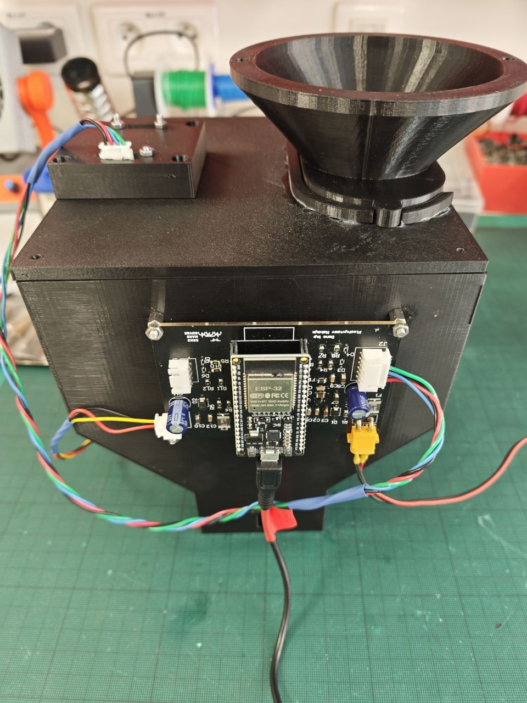
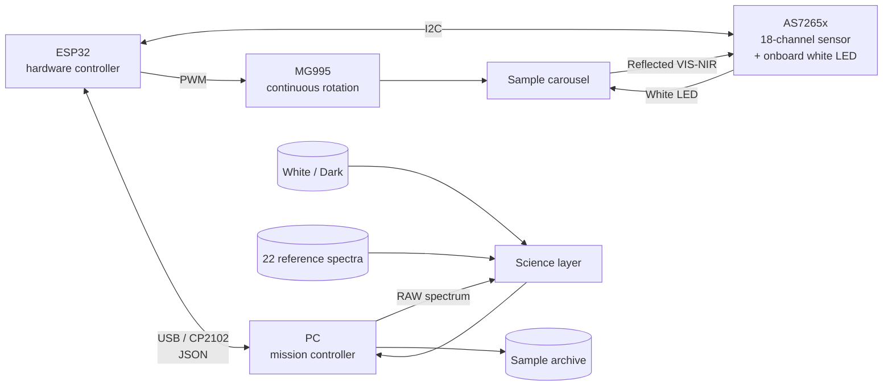
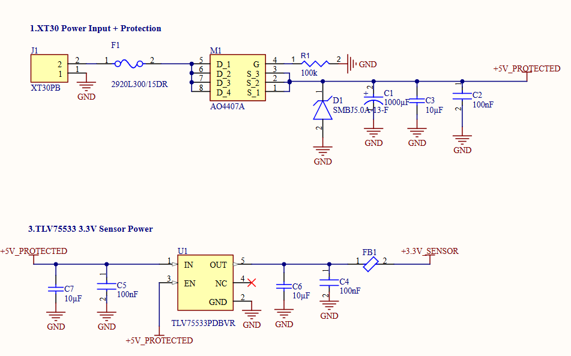
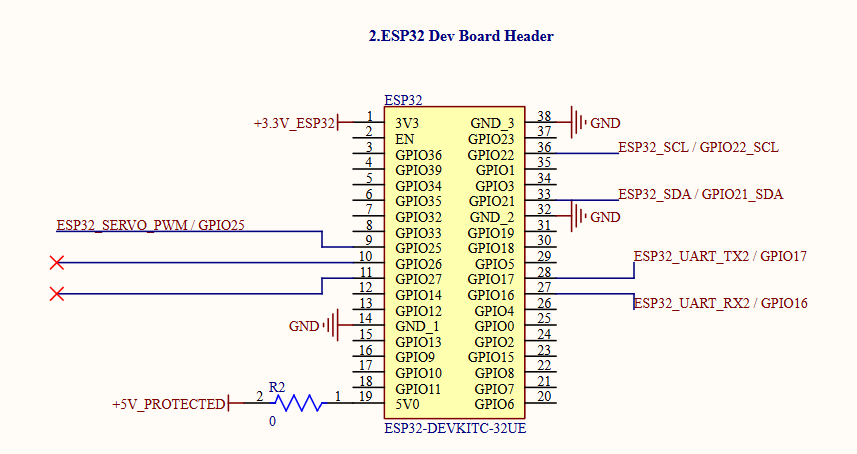
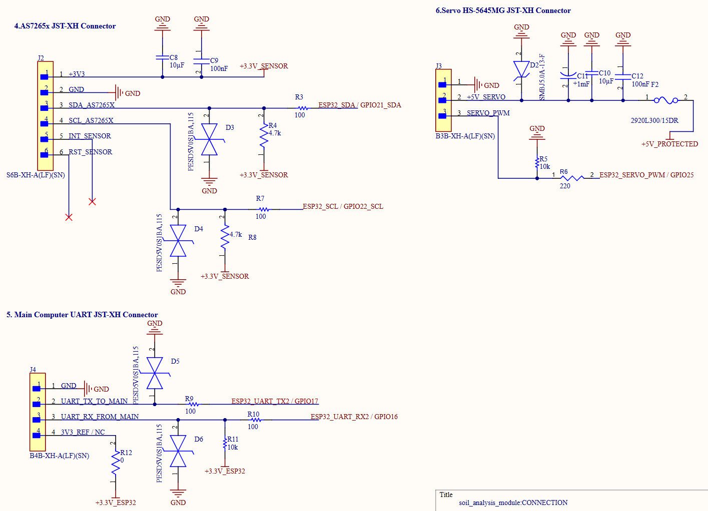
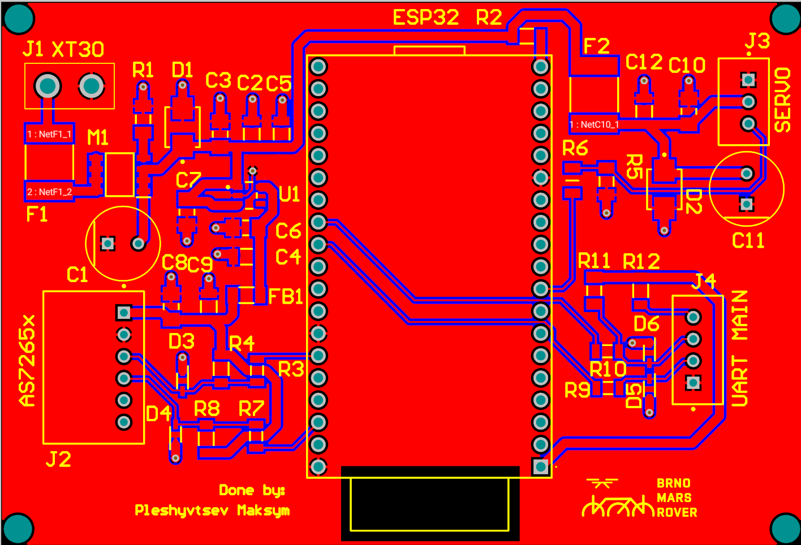
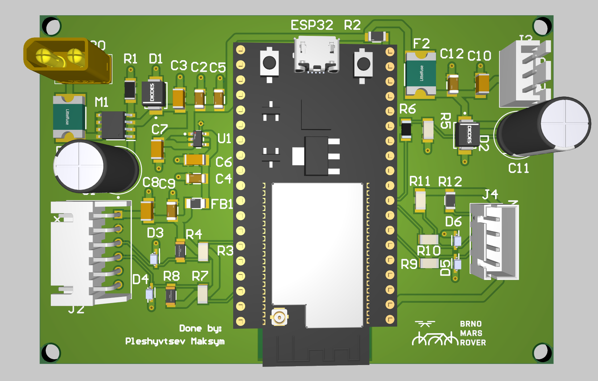
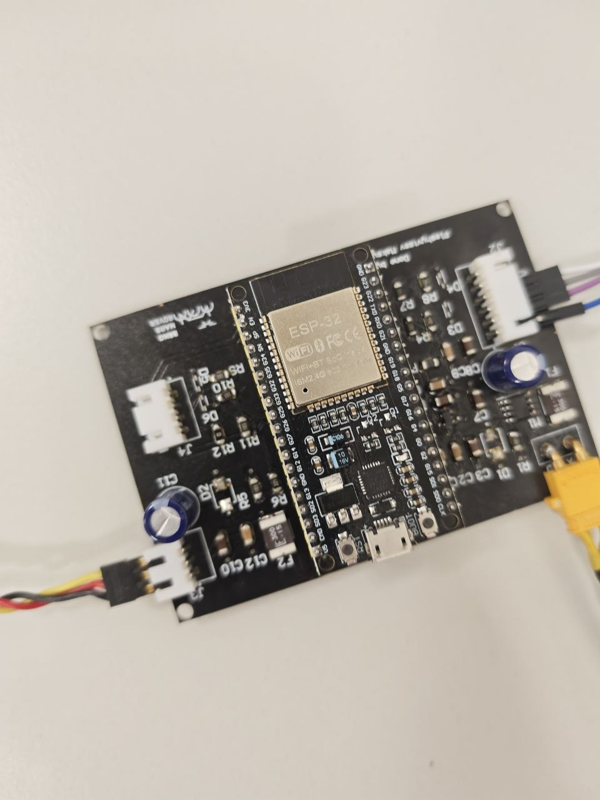

# AS7265x Soil Analysis Module

> Multispectral soil-analysis subsystem developed for the **Brno Mars Rover / Freya** science payload.


<p align="center">
  
</p>

---

## Overview

The **AS7265x Soil Analysis Module** is a rover-mounted subsystem for comparative multispectral analysis of soil and geological samples.

The final system combines:

- a custom two-layer ESP32 carrier PCB;
- an **AS7265x 18-channel VIS-NIR spectral sensor**;
- an **MG995 continuous-rotation servo**;
- an eight-slot sample carousel;
- protected 5 V rover power distribution;
- a filtered 3.3 V sensor supply;
- USB communication with the rover/main computer.

The AS7265x measures 18 spectral bands from approximately **410 nm to 940 nm**. Measurement illumination is provided by the **white LED integrated on the AS7265x sensor module**.

The ESP32 controls the physical hardware and acquires RAW spectra. Scientific processing, White/Dark normalization, database comparison and persistent sample storage run on the main computer.

> **Project state:** PCB V1.0 and the hardware are complete. Current work is limited to final servo calibration, spectral calibration, physical verification and minor firmware refinement.

---

## System Architecture


```mermaid
flowchart LR
    SAMPLE[Sample carousel]
    SENSOR[AS7265x<br/>18-channel sensor<br/>+ onboard white LED]
    ESP[ESP32<br/>hardware controller]
    SERVO[MG995<br/>continuous rotation]
    PC[PC<br/>mission controller]
    BD[Science layer]
    REFS[(White / Dark)]
    DB[(22 reference spectra)]
    STORE[(Sample archive)]

    ESP <-->|I2C| SENSOR
    SENSOR -->|White LED| SAMPLE
    SAMPLE -->|Reflected VIS-NIR| SENSOR

    ESP -->|PWM| SERVO
    SERVO --> SAMPLE

    ESP <-->|USB / CP2102<br/>JSON| PC
    PC -->|RAW spectrum| BD

    REFS --> BD
    DB --> BD

    BD --> PC
    PC --> STORE
```

```text
ESP32 = hardware control + RAW acquisition
BD    = spectral processing + reference database
PC    = mission workflow + persistent Sample storage
```

---

# Hardware V1.0

## Main Components

| Function | Component | Purpose |
|---|---|---|
| Main controller | ESP-WROOM-32 development board + CP2102 | I²C, PWM, hardware control and USB serial |
| Spectral sensor | AS7265x | 18 VIS-NIR channels from 410–940 nm |
| Illumination | AS7265x onboard white LED | Controlled measurement illumination |
| Carousel actuator | MG995 continuous-rotation servo | Eight-slot sample positioning |
| Sensor regulator | TLV75533PDBVR | Local 3.3 V sensor supply |
| Sensor filter | BLM31PG121SN1L | High-frequency supply-noise attenuation |
| Reverse-polarity protection | AO4407A | Low-loss protection of the 5 V input |
| Overcurrent protection | Littelfuse 2920L300/15DR | Resettable main and servo protection |
| Transient protection | SMBJ5.0A-13-F | 5 V rail transient suppression |
| Main connector | XT30PB | Rover 5 V power input |
| Signal connectors | JST-XH | Sensor, servo and reserved UART interfaces |

The final hardware uses **no external illumination MOSFET**. Illumination is controlled through the AS7265x sensor itself.

---

## Power Architecture

The carrier PCB is powered from the rover's regulated **5 V rail**.

```text
XT30 5 V
   │
   ▼
Main resettable fuse
   │
   ▼
AO4407A reverse-polarity protection
   │
   ▼
+5V_PROTECTED
   │
   ├──► ESP32 development board
   │
   ├──► Servo branch
   │      ├─ resettable fuse
   │      ├─ TVS protection
   │      └─ local bulk / ceramic capacitance
   │
   └──► TLV75533 3.3 V LDO
          │
          ▼
       ferrite bead
          │
          ▼
      +3V3_SENSOR
          │
          ▼
       AS7265x
```

The servo and spectral-sensor supplies are separated because the servo produces significant current transients and electrical noise, while the sensor benefits from a stable local rail.

> [!CAUTION]
> PCB V1.0 is designed for a regulated **5 V input**, not a higher-voltage battery rail.

---

## ESP32 Interfaces

| Function | ESP32 |
|---|---:|
| AS7265x SDA | GPIO21 |
| AS7265x SCL | GPIO22 |
| I²C bus | 0 |
| I²C frequency | 100 kHz |
| MG995 PWM | GPIO25 |
| Servo PWM frequency | 50 Hz |
| Reserved UART2 TX | GPIO17 |
| Reserved UART2 RX | GPIO16 |
| Main-computer link | USB / CP2102, 115200 baud |

The dedicated UART2 connector exists on the PCB but is currently **reserved and unused**.

The operational main-computer link uses the development board's USB / CP2102 interface.

---

## AS7265x Measurement

Expected AS7265x I²C address:

```text
0x49
```

Current acquisition configuration:

```text
integration cycles   = 100
gain                 = 16x
measurement mode     = 0b10
onboard LED current  = 25 mA
illumination settle  = 300 ms
```

### Acquisition Sequence

```text
ensure sensor ready
        ↓
AS7265x onboard white LED ON
        ↓
300 ms illumination settle
        ↓
start new integration
        ↓
wait DATA_READY
        ↓
read 18 calibrated channels
        ↓
validate spectrum
        ↓
AS7265x onboard white LED OFF
        ↓
return RAW spectrum
```

The LED shutdown is executed through a protected cleanup path so a failed acquisition does not intentionally leave the illumination enabled.

### Spectral Channels

| Channel | nm | Channel | nm | Channel | nm |
|---|---:|---|---:|---|---:|
| A | 410 | G | 560 | R | 730 |
| B | 435 | H | 585 | S | 760 |
| C | 460 | I | 610 | T | 810 |
| D | 485 | J | 645 | U | 860 |
| E | 510 | K | 680 | V | 900 |
| F | 535 | L | 705 | W | 940 |

The subsystem performs **comparative multispectral analysis**, not laboratory chemical identification.

---

# Sample Carousel

The mechanism contains **8 sample slots** and two fixed positions:

- `LOAD` — soil loading position;
- `SCAN` — AS7265x measurement position.

| Property | Value |
|---|---:|
| Slots | 8 |
| Slot spacing | 45° |
| LOAD ↔ SCAN | 180° / 4 slots |
| Position feedback | None |
| Position model | Operator synchronization + software tracking |

After every ESP32 reset, the physical position is unknown.

The operator aligns physical Slot 1 with the loading hole and establishes the carousel origin.

```text
Slot 1 at LOAD  →  Slot 5 at SCAN
Slot 2 at LOAD  →  Slot 6 at SCAN
Slot 3 at LOAD  →  Slot 7 at SCAN
...
```

### Geometry vs Calibration

Mechanical geometry is fixed:

```text
8 slots
45° between slots
180° between LOAD and SCAN
```

The continuous-rotation servo does not accept an angle command. Movement is controlled through PWM direction and calibrated runtime.

| Motion | Current value |
|---|---:|
| Neutral | 1500 µs |
| CW | 1600 µs |
| CCW | 1400 µs |
| One slot CW | 533 ms |
| One slot CCW | 600 ms |
| LOAD → SCAN | 2400 ms |
| SCAN → LOAD | 2400 ms |
| Fine adjustment | 13.3 ms/degree |

The 180° movement has an **independent calibration** and is not derived from four adjacent-slot commands.

If a movement fails, the firmware invalidates position tracking instead of guessing the mechanical state.

---

# Software Architecture

```text
firmware/
├─ ESP32/    MicroPython hardware controller
├─ BD/       PC-side spectral processing / database
├─ PC/       mission controller / operator application
└─ OPERATIONS.md
```

---

## ESP32 Firmware

```text
firmware/ESP32/
├─ boot.py
├─ main.py
├─ config.py
├─ as7265x.py
├─ mg995.py
└─ carousel.py
```

### Responsibilities

- AS7265x initialization and recovery;
- I²C communication;
- sensor configuration;
- configuration read-back verification;
- onboard LED control;
- RAW 18-channel acquisition;
- MG995 control;
- carousel position tracking;
- hardware status;
- JSON command protocol.

### Sensor Lifecycle

There is one production sensor path:

```text
create I²C
   ↓
scan bus
   ↓
verify 0x49
   ↓
verify internal AS7265x devices
   ↓
apply configuration
   ↓
read configuration back
   ↓
READY
```

A failed sensor initialization at boot is not permanently latched. Later sensor commands can retry the complete bring-up sequence.

---

## Command Protocol

Communication uses newline-delimited JSON over USB / CP2102.

| Command | Function |
|---|---|
| `ping` | Controller liveness |
| `get_status` | Sensor / servo / carousel state |
| `sync_position` | Establish carousel origin |
| `select_slot` | Bring a slot to LOAD |
| `move_slots` | Whole-slot movement |
| `fine_adjust` | Small correction in degrees |
| `clear_slot` | Clear physical slot state |
| `measure_raw` | Move to SCAN and acquire RAW spectrum |
| `sensor_test_raw` | Production-path sensor test |
| `servo_stop` | Stop and release servo PWM |

The ESP32 performs **no database access, material classification or persistent scientific storage**.

---

# Science Layer

```text
firmware/BD/
├─ config.py
├─ database.json
├─ database.py
├─ references.json
└─ sample_analysis.py
```

The science layer runs entirely on the PC.

---

## White / Dark Calibration

Per wavelength channel:

```text
Dark corrected:
C = S - D

Normalized reflectance:
R = (S - D) / (W - D)
```

where:

```text
S = measured Sample
D = stored Dark reference
W = stored White reference
```

The White/Dark calibration set is stored in:

```text
firmware/BD/references.json
```

Normal runtime does not automatically re-measure these references.

The current project stage includes final validation of the accepted calibration data.

---

## Material Database

The reference database contains **22 spectral reference materials**:

```text
firmware/BD/database.json
```

Each normalized measurement is compared against **every reference spectrum** using cosine similarity.

```text
RAW spectrum
     ↓
White / Dark normalization
     ↓
cosine similarity
     ↓
22 reference materials
     ↓
ranked results
     ↓
conservative interpretation
```

> [!IMPORTANT]
> Similarity is **not chemical composition or probability**.
>
> Correct:
>
> `Highest spectral similarity: Red Clay — 92.1 %`
>
> Incorrect:
>
> `The sample is 92.1 % Red Clay.`

Current interpretation parameters:

```text
minimum similarity    = 85.0 %
ambiguity margin      = 1.5 percentage points
```

These values are currently being validated using measurements of known materials.

---

# PC Mission Controller

```text
firmware/PC/
├─ esp32_link.py
├─ rover_science_client.py
├─ sample_store.py
└─ requirements.txt
```

The PC owns the scientific Sample lifecycle:

```text
EMPTY
  ↓
READY_TO_LOAD
  ↓
LOADED
  ↓
MEASURED
```

One Sample ID represents one physical/scientific sample from preparation through final analysis.

A completed Sample record can contain:

- Sample ID and physical slot;
- UTC timestamps;
- mission metadata;
- RAW spectrum;
- dark-corrected spectrum;
- normalized spectrum;
- sensor settings read back from hardware;
- calibration information;
- complete database ranking;
- automatic interpretation;
- hardware acquisition status.

RAW data is stored separately from derived results so measurements can be re-analysed later.

Sample records are written through a temporary file and atomic rename to reduce the risk of incomplete files.

---

# Measurement Workflow

```text
Synchronize carousel
      ↓
Choose slot
      ↓
Prepare Sample
      ↓
Rover arm deposits soil
      ↓
Confirm Loaded
      ↓
Verify sensor
      ↓
180° move to SCAN
      ↓
AS7265x LED + spectral acquisition
      ↓
RAW spectrum → PC
      ↓
White / Dark normalization
      ↓
Compare against all 22 references
      ↓
Save complete Sample record
```

After a successful measurement the selected sample remains at the scanner.

Selecting the next sample restores the loading orientation automatically.

---

# Verification

## Automated Tests

```text
tests/
├─ support.py
├─ test_esp32.py
├─ test_science.py
├─ test_pc.py
└─ test_integration.py
```

The regression suite covers:

- ESP32 sensor and command logic;
- simulated AS7265x / I²C behaviour;
- carousel control logic;
- science formulas;
- protected reference data;
- Sample persistence;
- JSON communication;
- software-level integration.

Run from `tests/`:

```powershell
py test_esp32.py
py test_science.py
py test_pc.py
py test_integration.py
```

### Physical Verification

Hardware development is complete.

Current physical work focuses on:

- MG995 movement calibration;
- adjacent-slot repeatability;
- independent LOAD ↔ SCAN calibration;
- AS7265x configuration read-back;
- known-material measurement repeatability;
- final White/Dark validation;
- interpretation-threshold tuning;
- complete end-to-end rover workflows.

---

# Engineering Development Process

```text
System requirements
      ↓
Architecture
      ↓
Component selection
      ↓
Altium schematic
      ↓
PCB layout
      ↓
Manufacturing package
      ↓
Manual assembly
      ↓
Bring-up / troubleshooting / rework
      ↓
Sensor + actuator integration
      ↓
Firmware + PC integration
      ↓
Calibration and verification
```

The project covers the complete prototype engineering chain from electrical architecture and component selection through PCB manufacturing, assembly, bring-up, integration and system-level verification.

---

# Hardware Gallery

## Complete Rover Module

<p align="center">
  
</p>

## Schematics

| Power | ESP32 |
|---|---|
|  |  |

<p align="center">
  
</p>

## PCB Design

| 2D PCB | 3D PCB |
|---|---|
|  |  |

## Assembled PCB

<p align="center">
  
</p>

---

# Repository Structure

```text
as7265x-soil-analysis-module/
├─ README.md
├─ HANDOFF.md
│
├─ Hardware/
│  ├─ 01_POWER.SchDoc
│  ├─ 02_ESP32.SchDoc
│  ├─ 03_CONNECTION.SchDoc
│  ├─ PCB1.PcbDoc
│  ├─ MarsRover_ScienceTeam.BomDoc
│  ├─ as7265x-soil-analysis-module.PrjPcb
│  └─ Manufacturing/
│     └─ V1.0/
│
├─ Photos/
│  └─ VER1.0/
│     ├─ 01_POWER_ver1,0.png
│     ├─ 02_ESP32_ver1,0.png
│     ├─ 03_CONNECTION_ver1,0.png
│     ├─ 2D_PCB_ver1,0.png
│     ├─ 3D_PCB_ver1,0.png
│     ├─ PCB_photo_ver1,0.jpg
│     └─ Fullprojec_photo_ver1,0.jpg
│
├─ firmware/
│  ├─ ESP32/
│  ├─ BD/
│  ├─ PC/
│  └─ OPERATIONS.md
│
└─ tests/
```

---

# Documentation

| Document | Purpose |
|---|---|
| `README.md` | Technical overview and project showcase |
| `firmware/OPERATIONS.md` | Installation, startup, calibration, testing and recovery |
| `HANDOFF.md` | Current development and verification handoff |
| Source code | Implementation details |
| `Hardware/` | Altium design and V1.0 manufacturing data |

---

# Scientific Scope

The subsystem is designed to:

- acquire repeatable 18-channel VIS-NIR spectra;
- normalize measurements against White/Dark references;
- compare spectral shape with a controlled material library;
- preserve both RAW and processed data.

It does **not** claim exact chemical composition, concentration or laboratory-grade mineral identification.

---

## License

No open-source license has currently been selected.

Until a `LICENSE` file is added, the project should be treated as **all rights reserved**.

---

## Acknowledgements

Developed as part of the **Brno Mars Rover / Freya** student rover project.

---

## Author

**Maksym Pleshyvtsev**  
Electronics and Communication Technologies Student  
Brno University of Technology — FEKT
