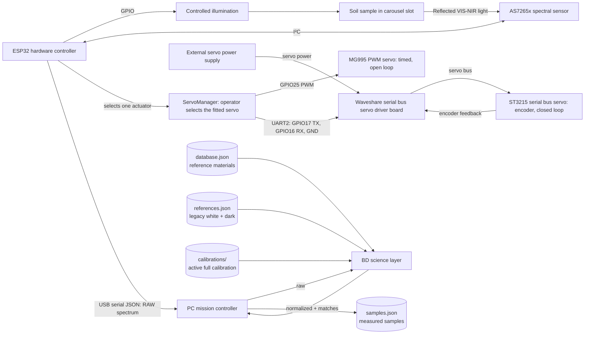

# AS7265x Soil Analysis Module

> Competition-ready multispectral soil-analysis payload developed for the **Brno Mars Rover / Freya** science subsystem.


<p align="center">
  
</p>

---

## Overview

The **AS7265x Soil Analysis Module** is a rover-mounted scientific payload designed for multispectral analysis of soils, minerals, salts, clays, and organic reference materials.

The system uses the **AS7265x 18-channel VIS-NIR spectral sensor** to measure reflected light between approximately **410 nm and 940 nm**. An ESP32 controls the sensor, the four-slot sample carousel, illumination, and the calibration pipeline.

The ESP32 is a **passive command-controlled instrument**. It performs no automatic movement and no automatic measurement: the main computer is the mission controller and issues one JSON command at a time over the USB serial link. The ESP32 moves the carousel, reads the sensor and returns a raw spectrum; all scientific processing and all persistent sample data live on the main computer.

The project combines:

- custom PCB design;
- protected power distribution;
- embedded control;
- multispectral data acquisition;
- calibration and measurement methodology;
- spectral database development;
- mechanical and rover-system integration.

The current PCB V1.0 provides the core functionality required for the competition while remaining open to future sensor and hardware improvements.

---

## Engineering Scope

The project was developed from system concept to an assembled and operational hardware platform.

The engineering work includes:

- defining the overall science-module architecture;
- selecting the sensor, controller, actuator, connectors, and protection components;
- designing the complete schematic in Altium Designer;
- creating a custom two-layer carrier PCB;
- designing protected 5 V and 3.3 V power branches;
- integrating I²C, UART (host link and ST3215 servo bus), legacy servo PWM, and illumination interfaces;
- preparing the component BOM and purchasing documentation;
- assembling and debugging the first PCB revision;
- developing ESP32 firmware for sensor and servo control;
- creating a structured spectral material database;
- defining calibration and sample-preparation procedures;
- preparing the system for mechanical integration with the Freya rover.

---

## System Operation

The module is command-driven. Nothing moves and nothing is measured until the rover main computer asks for it.

1. The operator aligns physical Slot 1 with the loading hole and confirms it (`sync_position`).
2. `select_slot` brings the next slot to the loading hole, normally one 90 deg clockwise step.
3. The PC creates a persistent Sample record with an ID and science metadata.
4. The external rover arm deposits soil; the operator confirms that it happened.
5. `measure_raw` rotates the slot to the scanner and acquires **raw** 18-channel spectra under WHITE, UV and IR illumination — 54 spectral features — then swings it back.
6. The PC normalizes the result **twice**: against the active full calibration for the scientific record, and against the legacy calibration for comparison with the material library.
7. Measurement quality control runs before anything is classified.
8. The WHITE reflectance is compared against **every** material on three metrics: cosine similarity, RMSE and Pearson correlation, combined by rank.
9. An automatic, deliberately conservative interpretation is generated and written to the same record opened in step 3.


```mermaid
flowchart LR
    SAMPLE[Soil sample in carousel slot]
    LIGHT[Controlled illumination]
    SENSOR[AS7265x spectral sensor]
    ESP[ESP32 hardware controller]
    MANAGER[ServoManager: operator selects the fitted servo]
    MG995[MG995 PWM servo: timed, open loop]
    DRIVER[Waveshare serial bus servo driver board]
    SERVO[ST3215 serial bus servo: encoder, closed loop]
    SUPPLY[External servo power supply]
    PC[PC mission controller]
    BD[BD science layer]
    DATABASE[(database.json<br/>reference materials)]
    REFS[(references.json<br/>legacy white + dark)]
    CAL[(calibrations/<br/>active full calibration)]
    STORE[(samples.json<br/>measured samples)]

    ESP -->|GPIO| LIGHT
    LIGHT --> SAMPLE
    SAMPLE -->|Reflected VIS-NIR light| SENSOR
    ESP <-->|I²C| SENSOR
    ESP -->|selects one actuator| MANAGER
    MANAGER -->|GPIO25 PWM| MG995
    MANAGER -->|UART2: GPIO17 TX, GPIO16 RX, GND| DRIVER
    SUPPLY -->|servo power| DRIVER
    DRIVER -->|servo bus| SERVO
    SERVO -->|encoder feedback| DRIVER
    ESP -->|USB serial JSON: RAW spectrum| PC
    PC -->|raw| BD
    DATABASE --> BD
    REFS --> BD
    CAL --> BD
    BD -->|normalized + matches| PC
    PC --> STORE
```

---

## Sample Carousel

The sample mechanism is a full 360° carousel, and **two actuators are supported**:

| | MG995 | Waveshare ST3215 |
|---|---|---|
| Interface | GPIO25 PWM | UART2 serial bus, through a Waveshare Serial Bus Servo Driver Board |
| Positioning | calibrated time | encoder counts |
| Feedback | none | 360° absolute magnetic encoder, 4096 counts/rev |
| Movement | commanded and assumed | commanded and **verified** |
| Telemetry | none | position, speed, load, voltage, temperature, current |
| Servo power | PCB branch, not switched by firmware | **external supply at the driver board** |

**The firmware never guesses which one is fitted.** After every boot no servo is selected, the carousel position is invalid, and every movement command answers `SERVO_NOT_SELECTED`. The operator states what is installed at **[0] Carousel Setup**.

That is deliberate rather than pedantic: probing UART2 and falling back to the MG995 would silently select timed open-loop control on a correctly fitted ST3215 with one broken wire, and start moving a carousel with no feedback. It would also make an MG995 build depend on a negative result from hardware that is not connected.

Switching actuator **always** invalidates the carousel position. A different servo has a different encoder zero, a different mounting and possibly a different mechanical reference, so no position state may cross that boundary.

What neither servo can know is which physical slot the operator calls Slot 1. There is no limit switch, no Hall sensor and no index mark, so the origin is declared by hand once per power-up. On the ST3215 that declaration also captures the encoder reading, tying the logical model to a real measurement; on the MG995 there is nothing to capture and the position is maintained by counting.

| Property | Value |
|---|---|
| Physical sample slots | 4 |
| Angle between neighbouring slot centres | 360° / 4 = **90°** |
| Scanning position ↔ loading position | **180°**, i.e. **2 slots** apart |
| ST3215 encoder resolution | 4096 counts / revolution = **0.0879° per count** |
| ST3215: one slot transition | 4096 / 4 = **1024 counts** |
| ST3215: loader ↔ scanner sweep | 4096 / 2 = **2048 counts** |
| MG995: one slot transition | `MG995_NEXT_SLOT_*_MS`, calibrated per direction |
| MG995: loader ↔ scanner sweep | `MG995_LOAD_TO_SCAN_CW_MS` / `MG995_SCAN_TO_LOAD_CCW_MS` |

The geometry is a property of the mechanism and is shared by both backends. The
counts are *derived* in `config.py` from the slot count and the encoder
resolution; the timings are empirical and belong to the MG995 alone. Nothing in
the firmware writes an angle or a count out by hand, and no constant is
ambiguous between the two actuators — every one is namespaced `MG995_*`,
`ST3215_*` or `CAROUSEL_*`.

Because the two fixed positions are exactly opposite, the slot at the loader follows directly from the slot at the scanner:

```text
load_slot = ((scan_slot - 1 + 2) % 4) + 1
```

The relationship is its own inverse and holds in both directions:

```text
Loader Slot 1  ↔  Scanner Slot 3
Loader Slot 2  ↔  Scanner Slot 4
```

Slots are numbered **1–4 clockwise**, and the origin is established by the operator: physical Slot 1 is aligned with the **soil loading hole** and declared as Slot 1.

```text
Slot 1 = loading position (the calibrated origin)
Slot 2 = 90°  clockwise from Slot 1
Slot 3 = 180° clockwise from Slot 1  (the scanner position)
Slot 4 = 270° clockwise from Slot 1
```

### Two levels of position

The firmware keeps a **logical** position and, where the hardware allows, a
**measured** one, and insists that they agree:

| Level | What it is | Where it comes from |
|---|---|---|
| Logical | which slot is at the scanner and at the loader | slot arithmetic, on either backend |
| Measured | where the servo actually is | the ST3215 encoder; **not available** on the MG995 |

On the MG995 the second level simply does not exist, and the firmware says so
rather than inventing it: `drift` is reported as *not measurable*, and the
backend's capabilities advertise `position_feedback: false` and
`verified_movement: false`.

After every reset the logical position is unknown:

```python
position_valid = False
current_scan_slot = None
selected_slot = None
origin_counts = None
```

Synchronization is the **first** operation after boot. The operator moves the
carousel with whole-slot and degree commands until Slot 1 sits under the
loading hole, then confirms it:

```json
{"cmd": "sync_position", "load_slot": 1}
```

`sync_position` never moves anything. It reads the servo encoder and stores
that reading as the carousel **origin**, tying the logical model to a real
measurement. Because the scanner is exactly 180° opposite, declaring Slot 1 at
the loader also declares **Slot 3 at the scanner**.

If the encoder cannot be read, **no origin is recorded** — an invented origin
would poison every movement that followed it.

From then on each movement is a relative movement in counts, verified from the
encoder before the logical position is allowed to change. If a movement cannot
be proved, the tracked position is **discarded** rather than guessed, and the
operator must re-synchronize. There is no fallback to timing.

The status block also reports `drift_counts`: how far the last verified reading
sits from the nominal target for the current slot. That is the number to watch
over a long session.

### Three separate position concepts

These are deliberately kept apart:

| Concept | Meaning |
|---|---|
| `current_load_slot` | Which slot is physically under the loading hole |
| `current_scan_slot` | Which slot is physically under the scanner |
| `selected_slot` | Which slot the operator is working with |

While soil is deposited the selected slot sits at the loader. A measurement swings it out to the scanner and back again, so once the operation completes the selected slot is at the loader once more.

### Choosing a slot

`select_slot` brings the chosen slot to the loading hole. Sequential progression is always one clockwise step, because any move of half the slot count or fewer resolves in the forward (clockwise) direction:

```text
Slot 1 -> Slot 2   = one clockwise slot transition
Slot 2 -> Slot 3   = one clockwise slot transition
Slot 4 -> Slot 1   = one clockwise slot transition
```

Each transition spans 90° of geometry, commanded as **1024 encoder counts**.

Selecting a distant slot still takes the shortest path, and the shortest path is
decided in **slots**, before anything is converted to counts. That is what keeps
`Slot 4 → Slot 1` a single +1024-count step instead of a 270° journey: the
absolute encoder crossing 4095 → 0 partway through simply does not enter into
it.

```text
encoder at 3900, step +1024  ->  encoder at 828      (one slot, 90°)
encoder at  100, step -1024  ->  encoder at 3172     (one slot, 90°)
```

A multi-slot request runs as N separate single-slot movements, each verified on
its own. That is not caution for its own sake: a single encoder reading cannot
distinguish a movement of more than half a turn from its complement, so one
long movement could not be proved.

### Movement: the same request, two very different executions

The carousel asks for the same thing either way — *move two slots clockwise*,
*swing half a turn*, *adjust by −2.5°* — and the selected backend decides what
that means physically.

**ST3215.** No duration appears anywhere:

```text
read start position
  -> convert the request to encoder counts
  -> write acceleration, goal, speed in one transaction
  -> poll the servo until it reports it has STOPPED
  -> settle
  -> read the position again
  -> compare against the target
  -> within tolerance?  yes -> update the logical position
                         no -> raise, invalidate, require a re-sync
```

**MG995.** No feedback appears anywhere:

```text
look up the calibrated runtime for this movement and direction
  -> optional start kick
  -> cruise at the calibrated pulse for that runtime
  -> optional slow approach, optional reverse brake
  -> neutral pulse, from a finally block
  -> settle, release the pin
  -> update the logical position, because nothing can contradict it
```

The MG995 keeps its per-movement calibration, because it genuinely needs one:
the same command travels a different distance clockwise and counter-clockwise,
and one long sweep does not cover the same angle as several short ones. The
ST3215 has no timing calibration at all — the servo closes its own loop, and
1024 counts is 1024 counts either way. Its three verification limits are:

| Constant | Meaning |
|---|---|
| `ST3215_POSITION_TOLERANCE` | how close counts as arrived (**check on the real mechanism**) |
| `ST3215_MOVE_TIMEOUT_*` | time budget, computed per movement from distance and speed |
| `ST3215_SETTLE_MS` | pause after the servo stops, before the reading that decides |

> [!IMPORTANT]
> `ST3215_POSITION_TOLERANCE` ships at a deliberately conservative 15 counts
> (≈1.3°) and **has not been measured on the mechanism**. The servo's own
> electronic dead zone is 0.176°, so a healthy carousel should settle far inside
> it. Tighten it once the real repeatability is known — but a tolerance that is
> too tight turns ordinary backlash into a failed measurement.

> [!NOTE]
> The direction asymmetry that dominates the MG995 is absent on the ST3215. It
> is an artefact of open-loop control: the servo runs at different speeds each
> way and the software has to compensate. A closed-loop actuator lands on its
> target from either side, which is why the ST3215 has one set of numbers where
> the MG995 needs two of everything.

Whichever backend is fitted, a movement that cannot be completed **invalidates
the tracked position** rather than being assumed. There is no fallback from one
backend's failure to the other backend's method: an ST3215 that loses feedback
does not revert to timing, and an MG995 does not pretend to have an encoder.

### Fine alignment

Alignment is corrected in **degrees**, converted to encoder counts, and verified
like any other movement:

```json
{"cmd": "fine_adjust", "degrees": -2.5}
```

Positive is clockwise. On the ST3215, `counts = round(degrees × 4096 / 360)`,
so 2.5° is 28 counts and one count is the 0.0879° floor below which the request
is reported as too small rather than silently ignored. On the MG995,
`duration = |degrees| × MG995_*_MS_PER_DEGREE`, and a request that rounds to no
runtime at all is reported the same honest way.

Fine adjustment is **alignment only** — it deliberately does not change the
logical slot numbering, the slot state or the sample ID. A carousel nudged by
+1.5° is still on the same logical slot in the same phase. Corrections are
capped by `MAX_FINE_ADJUST_DEG` (default ±15°); anything larger must use
whole-slot movement.

**The correction is remembered.** It accumulates into
`alignment_offset_deg`, which is part of every later expected position:

```text
expected position = origin + commanded slot travel + alignment offset
```

The offset is stored in degrees, not in backend units, so it means the same
thing on either actuator. On the ST3215 it records the angle actually
*commanded* after rounding to whole encoder counts — 2.0° becomes 23 counts,
which is 2.0215° — so quantization never shows up later as apparent drift.

So an operator who trims the carousel by +2° keeps that trim. The next slot
movement carries it along instead of quietly returning the mechanism to the old
theoretical centre. Re-synchronizing folds the offset into the new origin and
resets it to zero, because the position the operator has just confirmed *is* the
reference from then on.

### Measurement movement

Measurement is strict about what it will run on. The PC refuses unless the sample is `LOADED`, and the ESP32 independently refuses unless the slot is **the currently selected one** and physically **at the loading hole**. A slot that is not selected is refused with `SLOT_NOT_SELECTED`; a selected slot that is not at the loader is refused with `SLOT_NOT_AT_LOADER`. This is what stops the software's idea of the carousel from drifting away from the mechanism.

It then performs the full cycle — out, acquire, back:

```text
Slot X at LOAD
  -> +2048 counts, polled to completion and verified
Slot X at SCAN
  -> settle, acquire RAW
  -> -2048 counts, polled to completion and verified
Slot X at LOAD  ->  exactly where it started, phase = LOAD
```

The two halves are the same number of counts in opposite directions and both are
verified, so an out-and-back pair now closes on itself **by construction**
rather than by calibration. The return runs in the reverse direction so backlash
from the outbound sweep is taken up rather than accumulated.

If the outbound movement cannot be verified, the measurement does not happen:
there is no acquisition from a position the firmware cannot vouch for.

A successful measurement therefore leaves the sample at its original physical position and the tracked position identical to what it was before. The soil is still in the slot — `MEASURED` is not `EMPTY`.

The return is reported as its **own** outcome, separate from the acquisition:

| Acquisition | Return | Result |
|---|---|---|
| fails before the first move | not attempted | nothing moved, sample stays `LOADED` |
| fails at the scanner | attempted | failure reported, position restored if possible |
| succeeds | fails | **measurement is kept**, position invalidated, re-sync required |

Science acquisition and mechanical recovery are separate outcomes. A servo that could not come home never destroys a spectrum that was already read.

Whenever the return move fails, or completes but leaves the tracked position somewhere other than where it started, `position_valid` is set to `False` so the operator re-synchronizes rather than moving blind.

### One record per sample

A sample is a single scientific object from preparation to analysis. *Prepare Sample* opens the persistent record on the PC, *Confirm Loaded* updates it, and *Measure Sample* **completes that same record** — same Sample ID, preparation metadata preserved, no derived `S002_measurement` entity:

```text
Prepare Sample   ->  state READY_TO_LOAD, created_at, metadata
Confirm Loaded   ->  state LOADED, loaded_at
Measure Sample   ->  state MEASURED, measured_at, three spectra,
                     all database matches, analysis
```

---

## Servo Bring-up

Which procedure applies depends on what is fitted, and the first step is the
same either way: **state which servo is installed**, at `[0] Carousel Setup`.
Nothing will move until you do.

The full procedures are in
[`Documentation/OPERATIONS.md`](Documentation/OPERATIONS.md) — "MG995 bring-up
and calibration" and "ST3215 bring-up". In outline:

**MG995.** Ten calibration steps, in order, starting from true neutral and
ending with the out-and-back pair that Measure Sample depends on. Every value
is measured on the real mechanism, edited in RAM, and then pasted back into
`config.py`.

**ST3215.** A sequence of *checks*, of which only the last three move anything:
select the servo, run diagnostics, write the operating mode to servo EPROM once,
confirm the forward direction, measure repeatability, cross the encoder
boundary, then set the position tolerance from what you measured.

Everything configurable lives in [`ESP32/config.py`](ESP32/config.py), in
sections named for the actuator they belong to.

### ST3215: wiring, before power

```text
ESP32 PCB                        Waveshare servo driver board
---------                        ----------------------------
GPIO17 / TX2  ---------------->  TX
GPIO16 / RX2  ---------------->  RX
GND           <-------------->   GND

                NO POWER CONNECTION FROM THE ESP32 PCB
```

```text
External servo power supply (6–12.6 V, 12 V recommended)
          │
          ▼
Waveshare serial bus servo driver board
          │  servo bus
          ▼
       ST3215
          │
          ▼
       Carousel
```

> [!IMPORTANT]
> **The ST3215 servo subsystem is externally powered.** The Freya ESP32 science
> PCB provides only UART TX, UART RX and a common ground reference to the
> Waveshare serial bus servo driver. **No servo supply current is drawn from the
> ESP32 PCB**, and the firmware has no servo-power concept at all — no pin, no
> enable, no switch.

> [!CAUTION]
> The common ground is **not optional**. Two supplies with no shared reference
> means the UART has no defined logic level, and the symptom is a servo that
> either never answers or answers intermittently.

### ST3215: communication — **Tools → Servo / Carousel Tools → Diagnostics**

Moves nothing. It reports each stage separately: UART2 open, servo answers,
servo ID, baud rate, operating mode, torque state, angle limits, and the full
telemetry block (position, speed, load, voltage, temperature, current).

If it fails, check in this order: external servo supply, common ground, the
TX/RX pair, then the servo ID and baud rate.

### ST3215: operating mode — **SERVICE: write servo configuration**

Writes the ST3215 EPROM once: step servo mode, both angle limits cleared. It is
explicit, confirmed, and kept firmly apart from carousel setup: ordinary setup
establishes a runtime origin and writes nothing persistent to the servo. EPROM
has a finite write life, and silently reconfiguring a servo somebody set up by
hand is not something a science instrument should do.

The firmware **refuses to move** a servo that reports any other mode. In
position servo mode the same register means "go to this absolute count", so a
request for one slot would send the carousel somewhere else entirely.

### Either servo: forward direction — **Movement tests → One slot forward**

Move one slot and check whether the *next higher* or *next lower* slot number
arrives at the scanner. Set `CAROUSEL_FORWARD_DIRECTION` accordingly. This is
the one remaining thing software cannot know: it depends on how the carousel is
mounted, not on the actuator, so it is shared by both backends.

### Either servo: repeatability — **Movement tests → forward and back**, then
**Half turn out and back**

Both are symmetrical, so they should close on themselves. The reported closing
error, in counts, is the repeatability figure that matters for Measure Sample.
Use it to decide the final `ST3215_POSITION_TOLERANCE`.

Also run **Encoder boundary crossing (4095 → 0)**, which parks the servo just
short of the encoder seam and steps across it. A driver that thought in absolute
single-turn targets would take the long way round here; this one cannot.

---

## Main Features

- 18-channel spectral acquisition from approximately 410 nm to 940 nm;
- ESP32-based sensor and actuator control;
- four-slot 360° sample carousel with two supported actuators: an MG995
  (timed, open loop) and a closed-loop ST3215 serial bus servo with
  encoder-verified positioning, selected explicitly by the operator;
- deterministic USB-serial JSON command protocol for the main computer;
- persistent scientific sample storage on the main computer;
- fixed white and dark calibration references, never re-measured mid-run;
- comparison against every material in the spectral reference database;
- automatic, conservative interpretation of each measurement;
- USB programming and debugging through the ESP32 development board;
- protected 5 V rover power input;
- filtered 3.3 V sensor supply;
- separate protected servo power branch on the PCB (legacy, unused by the
  ST3215 configuration);
- MOSFET-controlled external illumination;
- JST-XH connectors for external modules;
- 1206 passive components for easier manual assembly.

---

## PCB V1.0

PCB V1.0 is the first fully assembled and operational competition version of the carrier board. It implements the core functionality required for the current Mars Rover science task, while leaving room for additional sensors and hardware improvements in future revisions.

The PCB is a two-layer carrier and interface board. The ESP32 development board, AS7265x sensor, servo, and illumination source are connected as external modules.

### PCB Design Characteristics

- two-layer PCB;
- bottom ground plane;
- top-side signal and power routing;
- protected XT30 5 V input;
- reverse-polarity protection;
- resettable main and servo fuses;
- separate sensor and servo power branches;
- local bulk and ceramic decoupling;
- external JST-XH interfaces;
- ESP32 mounted on female headers;
- four mechanical mounting holes;
- 1206 passive components where practical.

### V1.0 Hardware Images

| Power and protection | ESP32 section |
|---|---|
|  |  |

| External connections | PCB layout |
|---|---|
|  |  |

| PCB 3D model | Assembled PCB |
|---|---|
|  |  |

---

## Hardware Architecture

### Main Components

| Function | Component | Purpose |
|---|---|---|
| Controller | ESP-WROOM-32 development board with CP2102 | Sensor control, carousel control, USB serial communication and data processing |
| Spectral sensor | AS7265x multispectral triad | 18-channel VIS-NIR measurement |
| Servo | Waveshare ST3215 serial bus servo | Encoder-verified rotation of the four-slot sample carousel; **externally powered** |
| Servo interface | Waveshare Serial Bus Servo Driver Board | UART2 to servo bus; carries the external servo supply |
| Sensor regulator | TLV75533PDBVR | Protected 3.3 V sensor supply |
| Reverse-polarity protection | AO4407A | Protects the board from incorrect input polarity |
| Main and servo fuses | Littelfuse 2920L300/15DR | Resettable overcurrent protection |
| Input and servo TVS | SMBJ5.0A-13-F | Suppression of voltage transients |
| Sensor filtering | BLM31PG121SN1L | High-frequency noise filtering |
| Illumination switch | AO3400A | Low-side control of external illumination |
| Main power connector | XT30PB | Rover 5 V input |
| Signal connectors | JST-XH | Sensor, UART, servo and auxiliary connections |

---

## Power Architecture

The module is supplied by the rover's regulated **5 V power rail**.

```text
XT30 5 V input
 └─ Main resettable fuse
    └─ Reverse-polarity MOSFET
       └─ +5V_PROTECTED
          ├─ ESP32 development board
          ├─ Servo branch
          │  ├─ Resettable fuse
          │  ├─ TVS protection
          │  └─ Local bulk capacitance
          ├─ TLV75533 3.3 V sensor regulator
          │  └─ Ferrite bead
          │     └─ +3V3_SENSOR
          └─ Illumination branch
```

The input stage includes:

- resettable overcurrent protection;
- reverse-polarity protection;
- transient-voltage suppression;
- 1000 µF bulk capacitance;
- ceramic decoupling capacitors.

The servo branch is separated from the sensor supply to reduce the effect of servo current transients on spectral measurements.

> [!NOTE]
> **The PCB servo power branch is legacy hardware.** It was designed for the
> MG995, which drew its 5 V supply from this board. The ST3215 configuration
> does not use it: the servo subsystem is powered externally at the Waveshare
> driver board, and the only connection to it from this PCB is UART TX, UART RX
> and ground. The branch has deliberately **not** been removed from the
> schematic — it is populated hardware on an existing board, and a software
> migration is not the place to redesign a PCB. Treat it as unused in the
> current configuration.

> [!CAUTION]
> PCB V1.0 is designed for a regulated **5 V input**. It must not be connected directly to a higher-voltage battery rail.

---

## External Interfaces

### AS7265x Sensor

The external AS7265x module is connected through a 6-pin JST-XH interface.

| Signal | ESP32 connection | Description |
|---|---|---|
| `+3V3_SENSOR` | — | Filtered 3.3 V sensor supply |
| `GND` | GND | Common ground |
| `ESP32_SDA` | GPIO21 | I²C data |
| `ESP32_SCL` | GPIO22 | I²C clock |
| `AS7265X_INT` | Configurable GPIO | Sensor interrupt |
| `AS7265X_RST` | Configurable GPIO | Sensor reset |

The I²C lines include series resistors and optional pull-up and ESD-protection positions.

### UART2 — ST3215 servo bus

The PCB's dedicated 3.3 V UART interface now carries the servo link.

| Signal | ESP32 pin | Connects to | Description |
|---|---|---|---|
| `UART2_TX` | GPIO17 | driver board `TX` | ESP32 transmit |
| `UART2_RX` | GPIO16 | driver board `RX` | ESP32 receive |
| `3V3_REF` | 3.3 V | — | Logic-level reference |
| `GND` | GND | driver board `GND` | **Common ground — required** |

1 Mbps, 8N1. This is the *only* electrical connection between the servo
subsystem and this PCB, apart from the shared ground.

> [!IMPORTANT]
> **No servo power crosses this connector.** The ST3215 is supplied externally
> at the driver board. The ESP32 PCB provides signals and a ground reference,
> nothing else.

> [!NOTE]
> This peripheral is entirely separate from the host link. The PC talks to the
> ESP32 over USB on `sys.stdin` / `sys.stdout`; the servo talks over UART2. A
> servo transaction cannot disturb the host console, and vice versa.

### Main-computer link (USB)

The competition connection is the ESP32 development board's USB port:

```text
MAIN COMPUTER
      │  USB
      ▼
   CP2102
      │
      ▼
 ESP32 USB serial console
      │
      ▼
    main.py
```

The same cable both powers the ESP32 development board and carries the command protocol. Sensor and servo hardware are powered from the science board's protected rails as before.

Commands arrive on `sys.stdin` and responses leave on `sys.stdout`. The PC selects the baud rate (115200) when it opens the port; no pin or peripheral configuration is involved on either side.

### Servo connector (legacy, unused)

| Signal | Description |
|---|---|
| `+5V_SERVO` | Protected servo power — **legacy, not used** |
| `GND` | Servo ground |
| `SERVO_PWM` | Former MG995 PWM control (GPIO25) — **legacy, not driven** |

This connector, its dedicated power protection and its local bulk capacitance
were designed for the MG995. The ST3215 configuration uses none of it: the servo
is reached over UART2 and powered externally.

The hardware is left in place and documented rather than hidden — it exists on
the assembled board. The firmware, however, no longer references GPIO25 at all
and creates no PWM peripheral anywhere, so nothing drives this connector.

> [!NOTE]
> GPIO25 is therefore free in the current firmware. It is left unassigned rather
> than reused, so a board still wired for the MG995 cannot be driven by
> accident.

---

## Spectral Measurement

The AS7265x provides 18 nominal spectral channels:

| Channel | Wavelength | Channel | Wavelength | Channel | Wavelength |
|---|---:|---|---:|---|---:|
| A | 410 nm | G | 560 nm | R | 730 nm |
| B | 435 nm | H | 585 nm | S | 760 nm |
| C | 460 nm | I | 610 nm | T | 810 nm |
| D | 485 nm | J | 645 nm | U | 860 nm |
| E | 510 nm | K | 680 nm | V | 900 nm |
| F | 535 nm | L | 705 nm | W | 940 nm |

The module is designed for **comparative spectral analysis** rather than definitive laboratory chemical identification.

Measurement quality depends on:

- sensor-to-sample distance;
- sample fill level;
- illumination intensity and angle;
- integration time and sensor gain;
- grain size;
- moisture;
- surface geometry;
- sample compaction;
- ambient light;
- contamination from previous samples.

---

## Calibration

Every measurement is corrected using a dark and a white reference.

```text
Reflectance[i] =
    (Sample[i] - Dark[i])
    /
    (White[i] - Dark[i])
```

There is exactly **one** white reference and **one** dark reference for the whole competition run. Both live in [`BD/calibrations/legacy/references.json`](BD/calibrations/legacy/references.json), which is opened read-only and never written by any part of the system.

```json
{
  "white": { "A": 29.9166, "...": "...", "W": 61.7612 },
  "dark":  { "A": 0.0,     "...": "...", "W": 0.0 }
}
```

At startup the PC application loads the file, validates that both entries exist and that all 18 AS7265x channels are present and numeric, and reuses them for every sample. The ESP32 never sees this file; it does not need it to run the hardware.

Nothing measures white or dark: not at startup, not before a sample, not on any command. There is deliberately **no** "measure dark", "measure white" or "calibrate" command anywhere in the firmware or the application — the operator never performs calibration during normal operation.

The calibration set is identified as `FREYA_COMPETITION_2026_CAL_V1`, and every stored sample records that ID plus its provenance, so any record can be traced back to the references it was normalized against.

If the references are missing or invalid, the application still starts and **System Status** reports exactly what is at fault, while Measure Sample refuses to run rather than acquiring a spectrum that cannot be normalized.

Each measured sample stores three spectra, so a measurement can be re-derived later:

| Stored spectrum | Content |
|---|---|
| `raw` | Exactly what the AS7265x returned |
| `dark_corrected` | `Sample - Dark`, per channel |
| `normalized` | `(Sample - Dark) / (White - Dark)` |

Negative dark-corrected values are kept as they are. A channel reading below the stored dark reference is real information about noise or drift, and clamping it to zero would hide that from the operator.

PTFE is planned as the primary stable white-reference material.

---

## Software Architecture

The software is split by *what a machine has to be* to run it, not by convenience:

```text
                    MAIN COMPUTER
                         │
              ┌──────────┴──────────┐
              │                     │
              ▼                     ▼
             PC                     BD
     Mission Controller      Science / Database
              │                     ▲
              │ raw spectrum        │
              └─────────────────────┘
              │
              │ USB / CP2102
              │ newline JSON
              ▼
            ESP32
      Hardware Controller
              │
        ┌─────┴─────┐
        ▼           ▼
  MG995/ST3215    AS7265x
     Carousel      Sensor
```

| Layer | Runs on | Owns |
|---|---|---|
| `ESP32/` | MicroPython on the ESP32 | carousel, ST3215 servo bus, AS7265x, **raw** 18-channel acquisition, hardware status |
| `BD/` | CPython on the PC | fixed White/Dark, material database, dark correction, normalization, comparison, interpretation |
| `PC/` | CPython on the PC | operator interface, Sample lifecycle, persistent Sample archive, orchestration |

The boundaries are strict and enforced by the test suite:

- ESP32 imports nothing from `BD/` or `PC/`, and needs no JSON data file to move hardware or read the sensor.
- BD depends on no serial port, no I2C, no carousel and no long-lived measurement object — it is pure data processing.
- PC reaches the ESP32 **only** over the serial protocol, and BD **only** by import.

**The ESP32 does not know what material a sample resembles.** It moves hardware, reads hardware, and reports hardware.

---

## ESP32 Firmware

MicroPython executes `main.py` automatically after boot, but that startup does **not** move the servo, measure anything, or cycle through anything. It prepares the hardware and waits.

No servo is touched at boot at all — not initialized, not pinged, not powered, not moved. The firmware does not yet know which actuator is fitted, and guessing would mean driving a PWM pin or a UART at hardware that may not be there. Once the operator selects a servo, bringing it up is still **read-only** on the ST3215: open UART2, ping, read the mode and the position, stop. No goal position is written, no EPROM is touched and no torque state is changed, so power-cycling the board can never nudge the carousel out of the position the operator synchronized.

```text
ESP32 boot
 → create the carousel model, position unknown
 → bring the AS7265x up, with bounded retries
 → wait for a command on sys.stdin
 → execute exactly the requested command
 → send one JSON response on sys.stdout
 → wait again
```

A sensor that does not answer at boot does not take the module down: the command server, the carousel and `get_status` all keep working, the failure is recorded, and the next sensor-dependent command retries from scratch.

### Structure

```text
ESP32/
├─ boot.py       MicroPython boot hook (unused)
├─ main.py       transport, command dispatch, hardware handlers
├─ config.py     hardware settings: pins, gain, MG995_*, ST3215_*, CAROUSEL_*
├─ as7265x.py    AS7265x driver + the one sensor runtime lifecycle
├─ drivers/      external hardware only
│  ├─ as7265x.py            I2C, virtual registers, channel reads
│  ├─ servo_base.py         the vocabulary the two servos share
│  ├─ mg995.py              PWM pulse generation, timed movement
│  ├─ st3215.py             UART packets, registers, encoder feedback
│  └─ st3215_registers.py   the ST3215 wire protocol as pure data
├─ control/      hardware subsystem logic
│  ├─ servo_manager.py      which actuator is fitted, and its lifecycle
│  └─ carousel.py           slots, geometry, planning, position
├─ protocol/     the PC command protocol
│  ├─ transport.py          newline JSON on the USB console
│  ├─ router.py             dispatch, error envelopes, serving loop
│  └─ *_commands.py         servo, carousel, sensor, sample handlers
└─ carousel.py   4-slot geometry and software position tracking
```

Six files, and every one of them is uploaded to the device. Nothing else is.

### One sensor lifecycle

There is exactly one path to a working sensor:

```text
ensure_sensor_ready(force_reinit=False)
        │
        ├─ a working driver already exists? → use it
        │
        └─ otherwise
             → create I2C
             → bounded scan retries
             → verify 0x49
             → verify the internal VIS/NIR devices
             → apply the configuration
             → READ THE CONFIGURATION BACK and verify it
             → store the working objects
             → READY
```

Both `measure_raw` and `sensor_test_raw` go through it, so a passing sensor test really does prove that measurement acquisition works. There is no separate diagnostic driver that can succeed while the runtime one reports a failure.

The read-back matters. Firmware that only reports its *intended* settings will claim 100 cycles and 16x gain while the sensor is still running its power-on defaults. `apply_configuration()` writes the values from `config.py`, reads the registers back, and raises `SENSOR_CONFIG_NOT_APPLIED` naming the exact mismatch if they disagree — and every response carries the values that were read back, not the values that were requested.

### Raw acquisition

```text
ensure_sensor_ready()
        ↓
illumination ON  →  settle  →  start integration
        ↓
wait DATA_READY
        ↓
read 18 calibrated channels
        ↓
validate all 18
        ↓
illumination OFF   (from a finally block: no failure can leave the LED burning)
        ↓
return raw counts
```

The ESP32's scientific output ends at RAW. No dark correction, no white normalization, no database.

---

## Command Protocol

Newline-delimited JSON over the USB serial console at 115200 baud. One command is one JSON object followed by a newline; one response is one JSON object followed by a newline.

> [!IMPORTANT]
> `stdout` **is** the protocol stream. The firmware prints nothing outside the JSON protocol — no progress messages, no channel tables, no "servo moving" chatter. Diagnostics go through a `_debug()` helper gated by `config.DEBUG`, which defaults to `False`.
>
> MicroPython itself may still emit a boot banner, REPL text or a traceback on that same port. The PC client skips any line that is not valid JSON and only considers the module online once a `ping` has been answered.

Request:

```json
{"request_id": "42", "cmd": "get_status"}
```

Success:

```json
{"request_id": "42", "ok": true, "cmd": "get_status", "data": {}}
```

Error:

```json
{
  "request_id": "42",
  "ok": false,
  "cmd": "measure_raw",
  "error": {
    "code": "SLOT_NOT_AT_LOADER",
    "message": "Slot 1 is not at the loading position."
  },
  "data": {"moved": false}
}
```

### Commands

Ten commands, all of them hardware operations:

| Command | Purpose |
|---|---|
| `ping` | Liveness check |
| `get_status` | Sensor, carousel, servo and physical slot state |
| `sync_position` | Declare the origin: Slot 1 at the loading hole (moves nothing) |
| `select_slot` | Choose the physical slot and bring it to the loader |
| `move_slots` | Whole-slot movement, exactly 90° per slot |
| `acquire_block` | Repeat ONE illumination; every reading returned |
| `acquire_triad` | WHITE + UV + IR without moving the carousel |
| `led_test` | Exercise each lamp, reading its state back |
| `fine_adjust` | Small alignment correction in degrees; logical slot unchanged |
| `clear_slot` | Free a physical slot; the PC's scientific record is untouched |
| `measure_raw` | Swing to the scanner, acquire RAW under WHITE, UV and IR, swing back |
| `sensor_test_raw` | Exercise the whole sensor path and return RAW; moves nothing |
| `get_servo_options` | Which actuators are supported, and which is selected |
| `select_servo` | State which servo is installed; always invalidates the position |
| `servo_stop` | Stop the servo where it is; drops position tracking |
| `servo_diagnostics` | Check the active backend; **moves nothing** |
| `get_servo_calibration` | The active backend's tunables |
| `set_servo_calibration` | Override them in RAM (MG995 only) |
| `servo_test_move` | Operator-confirmed movement tests, per backend |
| `servo_configure` | ST3215 only: write the operating mode to servo EPROM |
| `servo_torque` | ST3215 only: hold or release the servo |

The carousel commands — `sync_position`, `select_slot`, `move_slots`,
`fine_adjust` — are deliberately **generic**. There is no `mg995_move_slot` or
`st3215_move_slot`: the PC says what it wants, and the firmware knows which
actuator is fitted.

There is deliberately no `measure_sample`, no `list_samples`, no `get_references` and no `get_database_status`. Those are science and persistence, and they live on the PC.

A successful `measure_raw` response:

```json
{
  "request_id": "42",
  "ok": true,
  "data": {
    "slot_id": 1,
    "sample_id": "S001",
    "raw": {"A": 1.23, "B": 2.34, "...": "...", "W": 4.56},
    "sensor_settings": {
      "integration_cycles": 100,
      "gain": 2,
      "gain_x": "16x",
      "measurement_mode": 2,
      "led_current": 1
    },
    "carousel": {"selected_slot": 1, "carousel_phase": "SCAN"}
  }
}
```

Every payload is JSON-safe primitives only. Exceptions are never serialized; they become `code`, `message`, `stage`, `exception_type` and `exception_message` fields.

### Failure semantics

- A sensor fault is detected **before** the carousel moves, so a broken sensor never strands a sample at the scanner.
- If acquisition fails after the swing, the firmware returns the mechanism to the loader and says so — or, if it cannot, invalidates position tracking rather than reporting a position it no longer knows.
- If the ESP32 fails before RAW is obtained, the PC leaves the sample `LOADED`. No false `MEASURED` state is ever written.
- If RAW arrives but the PC-side analysis fails, the spectrum is still saved with `analysis_status: "FAILED"` and the exact error. Acquired science survives downstream software failure.

---

## BD — Science Layer

`BD/` runs on the main computer and is never uploaded to the ESP32.

```text
BD/
├─ references.json     one fixed White + one fixed Dark   PROTECTED, READ ONLY
├─ database.json       22 reference material spectra       PROTECTED, READ ONLY
├─ config.py           calibration ID, thresholds, precision
├─ database.py         reference loading, cosine similarity, comparison
└─ sample_analysis.py  validation, the two formulas, interpretation
```

> [!CAUTION]
> `database.json` and `references.json` are authoritative scientific assets. Normal operation never writes to them, and neither `References` nor `MaterialDatabase` has a save path at all. Regenerating either would silently invalidate every measurement taken against it.

### Calibration model

The competition uses **one** accepted White and **one** accepted Dark for the whole run, stored in `references.json` under a single calibration ID. The operator is never asked to measure White or Dark, and nothing at runtime can re-measure them. That is what makes two samples taken hours apart comparable.

```text
S = raw sample spectrum from the ESP32
D = fixed Dark
W = fixed White

C = S - D                 dark corrected
R = (S - D) / (W - D)     normalized reflectance
```

Applied per channel, across all 18. Negative results are **kept**: a channel reading below the stored dark reference is real information about noise or drift, and clamping it to zero would hide that. Where `W == D` the reflectance is undefined and reported as `0.0`, with the affected channels named.

### Pure functions, no shared state

```python
validate_spectrum(raw)
dark_correct(sample, dark)
normalize(sample, dark, white)
database.compare(normalized)
interpret(matches)
```

Every one takes plain dictionaries and returns plain dictionaries. No `SoilMeasurementSystem`, no object whose `sample_data` can be `None` while a spectrum exists elsewhere. The `'NoneType' object has no attribute 'sample_data'` class of bug is structurally impossible here, because there is no shared object to disagree with itself.

### Comparison

The normalized spectrum is compared against **every** material in the database by cosine similarity, sorted best first. The complete ranking is stored with the sample; the interface decides how many rows to show.

---

## Automatic Interpretation

A compact written conclusion is generated from the best match, the second-best match, and the gap between them.

```text
STRONG_REFERENCE_MATCH   clear leader
AMBIGUOUS                top two candidates too close to separate
WEAK_REFERENCE_MATCH     nothing in the database is a good fit
NO_DATABASE              no reference materials available
```

Both thresholds live in `BD/config.py` and are recorded inside each sample record, so old results stay interpretable after retuning:

```python
MIN_SIMILARITY_PERCENT   = 85.0
AMBIGUITY_MARGIN_PERCENT = 1.5
```

> [!NOTE]
> These are **heuristic competition-support thresholds, not scientifically validated criteria**. Because cosine similarity between non-negative reflectance vectors is high for almost any pair, the informative quantity is the *gap* between the top candidates rather than the absolute score. Tune both against measurements of known materials.

The wording is deliberately constrained. This module performs **comparative spectral classification** against a small reference library. It reports spectral similarity, match scores and reference matches — never chemical probability, composition percentages or identification certainty.

Example output:

```text
The measured spectrum shows the highest cosine similarity to Red Clay
(91.4%). Bentonit is the second closest reference (87.2%). Because the
score difference is only 4.2 percentage points, the classification is
considered ambiguous.
```

---

## PC — Mission Controller

`PC/` is standard CPython.

```text
PC/
├─ rover_science_client.py   operator interface and mission workflow
├─ esp32_link.py             serial transport and the hardware command API
├─ sample_store.py           persistent Sample archive
├─ requirements.txt          pyserial
└─ data/
    ├─ samples.json          index of every Sample
    └─ samples/S001.json     one complete scientific record per Sample
```

BD is imported by path relative to the application, so it runs from any working directory with no `PYTHONPATH` setup.

### Sample lifecycle

```text
EMPTY
  ↓ Prepare Sample        record created, ID assigned, slot moved to the loader
READY_TO_LOAD
  ↓ Confirm Loaded        the rover arm has deposited soil
LOADED
  ↓ Measure Sample        RAW acquired, analysed, the SAME record completed
MEASURED
```

`MEASURED` is **not** `EMPTY`. The soil physically stays in the slot until the operator clears it. Clearing a physical slot frees the mechanism and keeps the scientific record; deleting a Sample is a separate, explicitly confirmed action.

The record opened by *Prepare* is the record completed by *Measure*. One coherent scientific object per sample — no second Sample ID is ever created during measurement.

### Sample record

Each record holds the Sample ID and slot, the lifecycle state, PC-supplied timestamps, mission metadata, all three spectra across all 18 channels, the sensor settings *read back from the sensor*, the calibration provenance, the ranked match against every database material, and the automatic interpretation.

Raw is primary data and is never overwritten by anything derived from it. `raw`, `dark_corrected` and `normalized` are stored separately, which is what makes offline re-analysis possible: a stored spectrum can be re-run later against different thresholds, an updated material database or a different accepted calibration, without repeating the physical acquisition.

Writes go through a temporary file and an atomic rename. A present-but-unparseable index is reported and every write refused, rather than overwritten — data that looks damaged is usually still recoverable by hand.

The PC supplies every timestamp, because the ESP32 has no reliable wall clock and never invents one:

```python
datetime.now(timezone.utc).isoformat()
```

Mission metadata is task, hypothesis, location, map point, note and photo reference. Every field is optional; an unanswered field stays `null` rather than being invented to satisfy a prompt. Photos are never stored — only a filename, ID or path.

### Operator interface

```text
============================================================
 FREYA SCIENCE MODULE
============================================================

Selected: Slot 1 / S001
State:    LOADED
Position: LOAD

Loader: Slot 1    Scanner: Slot 3

1  S001     LOADED
2  ----     EMPTY
3  ----     EMPTY
4  ----     EMPTY

[1] Choose Sample / Slot
[2] Prepare Sample [DONE]
[3] Confirm Sample Loaded [DONE]
[4] Measure Sample [AVAILABLE]
[5] Fine Carousel Alignment

[t] Tools / Records
[h] Help
[q] Exit
```

Everything secondary lives behind `[t]`: Sample Database, System Status, Re-sync Carousel, Servo / Carousel Tools, Sensor Test, Clear Physical Slot, Sync ESP32 Samples to PC.

**Sensor Test is one command.** The operator never has to decide which internal layer to test: it runs the whole chain — ESP32 sensor recovery, I2C, internal devices, configuration, illumination, a new 18-channel acquisition, then the PC's dark correction, normalization and database comparison — through the production code path, prints every stage as PASS or FAIL, and saves nothing.

**Sync ESP32 Samples to PC.** The ESP32 keeps the last raw acquisition per slot in RAM so a result is not lost if this application crashes, is restarted, or is replaced by a different laptop mid-run. Tools → *Sync ESP32 Samples to PC* copies anything the archive is missing, runs it through the normal BD pipeline, and stores it as a complete record. It is a copy, not a move: an existing Sample ID is skipped rather than overwritten, the device keeps its own copy, and running it twice transfers nothing the second time.

For installation, upload, startup and recovery procedures, see **[Documentation/OPERATIONS.md](Documentation/OPERATIONS.md)**.

---

## Competition Workflow

```text
INITIAL CAROUSEL CALIBRATION   Slot 1 under the loading hole, declared once
    ↓
CHOOSE SLOT                    ESP32 brings the slot to the loading hole
    ↓
PREPARE SAMPLE                 PC creates the persistent record
    ↓
external rover arm deposits soil
    ↓
CONFIRM LOADED                 state = LOADED
    ↓
MEASURE SAMPLE
    ↓        ESP32   180° swing to the scanner
    ↓        ESP32   RAW 18-channel acquisition
    ↓        ESP32   180° swing back to the loading position
    ↓        PC      receives RAW
    ↓        BD      validation, C = S - D, R = (S-D)/(W-D)
    ↓        BD      comparison against ALL materials, interpretation
    ↓        PC      completes and saves the SAME record
    ↓
state = MEASURED, soil still physically in the slot
    ↓
operator adds location, map point, photo, notes
    ↓
REPORT
```

A typical mid-run state:

```text
Slot 1   S001   MEASURED
Slot 2   S002   LOADED
Slot 3   S003   MEASURED
Slot 4   ----   EMPTY
```

---
## Spectral Material Database

A dedicated database is being developed for calibration, comparison, and future classification algorithms.

The database contains:

### Martian and Geological Analogs

- iron oxides;
- iron sulfate;
- magnesium sulfate;
- sulfur;
- gypsum;
- calcium and magnesium carbonates;
- kaolin;
- bentonite and smectite clays;
- quartz sand;
- dolomite;
- terrestrial soils and mineral mixtures.

### Optical References

- PTFE white reference;
- magnesium oxide;
- calcium carbonate;
- activated carbon;
- black iron oxide.

### Organic and Contamination References

- citric acid;
- ascorbic acid;
- tartaric acid;
- cornstarch;
- peat;
- PET plastic;
- wood ash;
- rover-related contamination materials.

A recommended database record contains:

```csv
timestamp,
sample_id,
material,
preparation,
distance_mm,
mass_g,
integration_time,
gain,
ch_410,
ch_435,
ch_460,
ch_485,
ch_510,
ch_535,
ch_560,
ch_585,
ch_610,
ch_645,
ch_680,
ch_705,
ch_730,
ch_760,
ch_810,
ch_860,
ch_900,
ch_940
```

The database is intended for training and validating comparative classification methods. It does not provide definitive chemical identification from a single spectrum.

`BD/databases/legacy_18ch/database.json` holds **known reference materials only**. Measured competition samples are stored separately in `BD/samples/samples.json`, and nothing in the system writes to the reference database.

Each measurement is compared against every entry in the database, and all results are stored ranked by descending similarity — not only the top few.

> [!IMPORTANT]
> The match percentage is **cosine similarity**, not composition and not probability.
>
> Correct: `Highest spectral similarity: Red Clay — 92.1%`
> Incorrect: `The sample is 92.1% Red Clay.`

---

## Development Process

The module was developed through the following stages:

1. **System definition**  
   Sensor, controller, actuator, communication, power, and mechanical requirements were defined.

2. **Component selection**  
   Components were selected according to electrical requirements, availability, package size, protection level, and manual assembly constraints.

3. **Schematic design**  
   Separate power, controller, and external-interface schematic sections were created in Altium Designer.

4. **PCB layout**  
   The board was routed as a two-layer PCB with a ground plane, protected power branches, mounting holes, and accessible external connectors.

5. **Manufacturing and assembly**  
   Gerber files were generated, the PCB was manufactured, and components were assembled manually.

6. **Firmware integration**  
   ESP32 firmware was developed to operate the spectral sensor and sample-handling servo.

7. **Scientific validation**  
   White-reference measurements, spectral acquisition, material selection, and database preparation were performed.

---

## Current Project Status

### Implemented

- assembled PCB V1.0;
- protected power-input architecture;
- ESP32 carrier-board integration;
- AS7265x communication;
- multispectral channel acquisition;
- ST3215 serial bus servo driver with encoder-verified positioning
  (replaced the original timed MG995 PWM driver);
- four-slot carousel state model with software position tracking;
- USB-serial JSON command protocol (CP2102 console, no UART peripheral);
- three-layer software split: ESP32 hardware / BD science / PC mission control;
- single authoritative sensor lifecycle with automatic recovery;
- verified sensor configuration, read back from the registers;
- persistent sample storage on the PC;
- fixed white/dark reference calibration;
- comparison against the full reference-material database;
- automatic conservative interpretation;
- main-PC application with a reusable serial API;
- external illumination control architecture;
- rover UART hardware interface (reserved for a future revision);
- structured spectral-material database;
- mechanical mounting provisions.

### Ongoing Work

- servo bring-up on the assembled mechanism (mode configuration, forward
  direction, position tolerance from measured repeatability);
- final rover mechanical integration;
- measurement repeatability testing;
- distance-dependent spectral correction;
- tuning the interpretation thresholds against known materials;
- integration of the client API into the rover main software.

---

## Planned V1.1 Improvements

Future hardware revisions are planned to include:

- VL53L4CD time-of-flight distance sensor;
- automatic recording of sample height and sensor distance;
- optional load-cell support;
- external HX711 validation;
- possible NAU7802 integration;
- improved servo and logic power separation;
- additional test points;
- improved connector labelling;
- revised power protection;
- a rover-side command channel that does not share UART2 with the servo bus;
- expanded automated calibration and data logging.

The distance sensor is considered the highest-priority measurement extension because spectral intensity depends strongly on sensor-to-sample geometry.

The load cell is planned as optional experimental metadata rather than a requirement for the current competition task.

---

## Repository Structure

```text
as7265x-soil-analysis-module/
├─ README.md
├─ HANDOFF.md
├─ Photos/
├─ Hardware/            Altium project and manufacturing outputs
├─ ESP32/               MicroPython hardware controller (the only uploaded code)
├─ PC/                  mission controller, operator UI, serial transport
├─ BD/                  persistent scientific data + repositories
├─ Measurements/        scientific mathematics
├─ Tests/               regression suite, runs the real firmware on CPython
├─ Documentation/       OPERATIONS.md, ADRs, protocols
└─ research/            evidence matrix, research and benchmark reports
```

Manufacturing outputs should be stored separately for each PCB revision:

```text
Hardware/Manufacturing/
├─ V1.0/
└─ V1.1/
```

---

## Documentation

Project documentation includes:

- PCB architecture and component models;
- consolidated BOM;
- component purchasing list;
- spectral material database;
- PCB schematic and layout images;
- manufacturing files;
- firmware and measurement data.

Recommended repository links:

- [Operations runbook](Documentation/OPERATIONS.md) — install, upload, run, debug, recover
- [PCB BOM and component models](Documentation/Mars%20Rover%20AS7265x%20Soil%20Analyzer%20PCB%20-%20BOM%20_%20Component%20Models%20v0.1.pdf)
- [PCB purchase list](Documentation/Purchase%20List%20-%20Mars%20Rover%20AS7265x%20PCB.docx)
- [Spectral material database](Documentation/Spectral%20Material%20Database.docx)

Document roles are kept separate on purpose:

| Document | Answers |
|---|---|
| `README.md` | what the project is, how it is built, what the science means |
| `Documentation/OPERATIONS.md` | how to install, run, update, debug and recover it |
| source code | how the implementation works |

---

## Long-Term Development

After the current competition system is completed, possible development directions include:

- improved multispectral classification;
- distance and geometry compensation;
- automated sample identification;
- additional optical sensors;
- fluorescence measurements;
- a larger SHERLOC-inspired rover science module;
- onboard scientific decision support.

These concepts represent future development beyond PCB V1.0.

---

## License

No open-source license has currently been selected.

Until a `LICENSE` file is added, the project should be treated as **all rights reserved**.

---

## Acknowledgements

Developed as part of the **Brno Mars Rover / Freya** student rover project.

The goal of the module is to create a practical, competition-ready scientific payload for repeatable multispectral analysis of geological and soil samples.

---

## Author

**Maksym Pleshyvtsev**  
Electrical Engineering Student  
Brno University of Technology — FEKT
