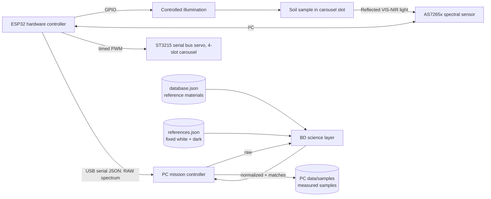

# AS7265x Soil Analysis Module

> Multispectral soil-analysis subsystem developed for the **Brno Mars Rover / Freya** science payload.


<p align="center">
  
</p>

---

# 1. System Architecture & Sensor Task

## Overview

The **AS7265x Soil Analysis Module** is a rover-mounted subsystem for comparative multispectral analysis of soil and geological samples.

The system uses the **AS7265x 18-channel VIS-NIR spectral sensor** to measure reflected light between approximately **410 nm and 940 nm**. An ESP32 controls the sensor, a **four-slot sample carousel** driven by a Waveshare **ST3215** serial bus servo, and the illumination.

The ESP32 is a **passive command-controlled instrument**. It performs no automatic movement and no automatic measurement: the main computer is the mission controller and issues one JSON command at a time over the USB serial link. The ESP32 moves the carousel, reads the sensor and returns a raw spectrum; all scientific processing and all persistent sample data live on the main computer.

The project combines:

- custom PCB design;
- protected power distribution;
- embedded control;
- multispectral data acquisition;
- calibration and measurement methodology;
- spectral database development;
- mechanical and rover-system integration.

The current PCB V1.0 provides the core functionality required for the competition while remaining open to future sensor and hardware improvements.

---

## Engineering Scope

The project was developed from system concept to an assembled and operational hardware platform.

The engineering work includes:

- defining the overall science-module architecture;
- selecting the sensor, controller, actuator, connectors, and protection components;
- designing the complete schematic in Altium Designer;
- creating a custom two-layer carrier PCB;
- designing protected 5 V and 3.3 V power branches;
- integrating I²C, UART, PWM, and illumination interfaces;
- preparing the component BOM and purchasing documentation;
- assembling and debugging the first PCB revision;
- developing ESP32 firmware for sensor and servo control;
- creating a structured spectral material database;
- defining calibration and sample-preparation procedures;
- preparing the system for mechanical integration with the Freya rover.

---

## System Operation

The module is command-driven. Nothing moves and nothing is measured until the rover main computer asks for it.

1. The operator aligns physical Slot 1 with the loading hole and confirms it (`sync_position`).
2. `select_slot` brings the chosen slot to the loading hole, one 90 deg step per slot.
3. The PC creates a persistent Sample record with an ID and science metadata.
4. The external rover arm deposits soil; the operator confirms that it happened.
5. `measure_raw` rotates the same physical slot to the scanner, settles, and acquires one **raw** 18-channel spectrum.
6. The PC corrects that spectrum with the **fixed** stored dark and white references.
7. The normalized spectrum is compared against **every** material in the reference database.
8. An automatic, deliberately conservative interpretation is generated.
9. The complete scientific record is written to the PC archive — the same record opened in step 3.


```mermaid
flowchart LR
    SAMPLE[Soil sample in carousel slot]
    LIGHT[Controlled illumination]
    SENSOR[AS7265x spectral sensor]
    ESP[ESP32 hardware controller]
    SERVO[ST3215 serial bus servo, 4-slot carousel]
    PC[PC mission controller]
    BD[BD science layer]
    DATABASE[(database.json<br/>reference materials)]
    REFS[(references.json<br/>fixed white + dark)]
    STORE[(PC data/samples<br/>measured samples)]

    ESP -->|GPIO| LIGHT
    LIGHT --> SAMPLE
    SAMPLE -->|Reflected VIS-NIR light| SENSOR
    ESP <-->|I²C| SENSOR
    ESP -->|timed PWM| SERVO
    ESP -->|USB serial JSON: RAW spectrum| PC
    PC -->|raw| BD
    DATABASE --> BD
    REFS --> BD
    BD -->|normalized + matches| PC
    PC --> STORE
```

---

## Sample Carousel

The sample mechanism is a **four-slot carousel** on a full 360 deg axis,
driven by a Waveshare **ST3215 serial bus servo**. The ST3215 has a
4096-count absolute magnetic encoder and runs its own closed position
loop, so every movement is commanded in encoder counts and then
**verified by reading the encoder back**.

```
4 slots, 90 deg apart
loader and scanner exactly 180 deg apart = 2 slots

    load_slot = ((scan_slot - 1 + 2) % 4) + 1
```

The mapping is its own inverse: Slot 1 at the loader necessarily means
Slot 3 at the scanner.

### Two fixed positions

```
SCAN   the slot under the AS7265x
LOAD   the slot under the loading hole
```

A measurement swings the selected slot 180 deg to the scanner, acquires
WHITE, UV and IR spectra, and swings it 180 deg back, so the sample ends
exactly where it started.

### Software position tracking

The carousel has no limit switch, no Hall sensor and no physical index,
so nothing can tell the firmware which physical slot the operator calls
Slot 1. That is declared once, by hand, through option `[0]` — which
never moves anything. The declaration also captures the ST3215's encoder
reading, tying the logical model to a real measurement.

Position confidence is **runtime state and deliberately forgotten on
reset**. It is also dropped whenever the firmware can no longer vouch
for it: after a servo reconnect, after torque is released so the
carousel can be turned by hand, after a stop mid-movement, and after any
movement that fails to verify. Normal movement is then refused until the
operator re-synchronizes. The firmware never guesses.

### Logical geometry is not actuator calibration

One slot is 90 deg, always — even where the real mechanism needs a small
correction. The correction is a mechanical calibration; the 90 deg is a
fact about the carousel, and nothing tunes it.

### Fine alignment

Option `[5]` applies a small physical correction, bounded by
`MAX_FINE_ADJUST_DEG`. It does **not** renumber slots, redefine the
origin or act as a hidden whole-slot move: after a fine adjustment the
logical slot identity is exactly what it was.

### Safe measurement order

The sensor is proved usable **before** the mechanism moves. A sensor
fault should not leave a sample stranded at the scanner, and a carousel
that has already turned cannot un-turn to prove a point.

## Servo Calibration

Nothing here is a timing calibration. The ST3215 is commanded in encoder
counts and verified from the encoder afterwards, so the values in
`ESP32/config.py` are engineering settings rather than numbers to be
trimmed against a stopwatch:

| Setting | Meaning |
|---|---|
| `ST3215_MODE = 3` | step servo — the goal register IS a relative step count |
| `ST3215_SPEED` | goal speed in encoder steps per second |
| `ST3215_ACCELERATION` | start/stop ramp, in units of 100 steps/s^2 |
| `ST3215_POSITION_TOLERANCE` | how close counts as arrived |
| `ST3215_SETTLE_MS` | ring-down before the encoder reading that decides |

Step servo mode is what a carousel needs: a carousel turns forever in
one direction, and an absolute single-turn target would have to cross
the 4095/0 seam and send the mechanism the long way round.

`ST3215_POSITION_TOLERANCE` is **conservative and not yet measured on
the real mechanism**. Tighten it once the true repeatability is known —
but a tolerance that is too tight turns ordinary backlash into a failed
measurement.

## Main Features

- 18-channel spectral acquisition from approximately 410 nm to 940 nm;
- ESP32-based sensor and actuator control;
- four-slot 360° sample carousel with encoder-verified movement;
- deterministic USB-serial JSON command protocol for the main computer;
- persistent scientific sample storage on the main computer;
- fixed white and dark calibration references, never re-measured mid-run;
- comparison against every material in the spectral reference database;
- automatic, conservative interpretation of each measurement;
- USB programming and debugging through the ESP32 development board;
- protected 5 V rover power input;
- filtered 3.3 V sensor supply;
- separate protected servo power branch;
- MOSFET-controlled external illumination;
- JST-XH connectors for external modules;
- 1206 passive components for easier manual assembly.

---

# 2. Hardware

## Hardware V1.0

The final hardware is built around a custom two-layer carrier PCB connecting the ESP32 controller, AS7265x spectral sensor and carousel servo.

## Main Components

| Function | Component | Purpose |
|---|---|---|
| Controller | ESP-WROOM-32 development board with CP2102 | Sensor control, carousel control, USB serial communication and data processing |
| Spectral sensor | AS7265x multispectral triad | 18-channel VIS-NIR measurement |
| Servo | Waveshare ST3215 serial bus servo | Encoder-verified rotation of the four-slot sample carousel, on UART2 |
| Sensor regulator | TLV75533PDBVR | Protected 3.3 V sensor supply |
| Reverse-polarity protection | AO4407A | Protects the board from incorrect input polarity |
| Main and servo fuses | Littelfuse 2920L300/15DR | Resettable overcurrent protection |
| Input and servo TVS | SMBJ5.0A-13-F | Suppression of voltage transients |
| Sensor filtering | BLM31PG121SN1L | High-frequency noise filtering |
| Illumination switch | AO3400A | Low-side control of external illumination |
| Main power connector | XT30PB | Rover 5 V input |
| Signal connectors | JST-XH | Sensor, UART, servo and auxiliary connections |

---

## Power Architecture

The carrier PCB is powered from the rover's regulated **5 V rail**.

```text
XT30 5 V
   │
   ▼
Main resettable fuse
   │
   ▼
AO4407A reverse-polarity protection
   │
   ▼
+5V_PROTECTED
   │
   ├──► ESP32 development board
   │
   ├──► Servo branch
   │      ├─ resettable fuse
   │      ├─ TVS protection
   │      └─ local bulk / ceramic capacitance
   │
   └──► TLV75533 3.3 V LDO
          │
          ▼
       ferrite bead
          │
          ▼
      +3V3_SENSOR
          │
          ▼
       AS7265x
```

The input stage includes:

- resettable overcurrent protection;
- reverse-polarity protection;
- transient-voltage suppression;
- 1000 µF bulk capacitance;
- ceramic decoupling capacitors.

The servo branch is separated from the sensor supply to reduce the effect of servo current transients on spectral measurements.

> [!CAUTION]
> PCB V1.0 is designed for a regulated **5 V input**, not a higher-voltage battery rail.

---

## Electrical Interfaces

### AS7265x Sensor

The external AS7265x module is connected through a 6-pin JST-XH interface.

| Signal | ESP32 connection | Description |
|---|---|---|
| `+3V3_SENSOR` | — | Filtered 3.3 V sensor supply |
| `GND` | GND | Common ground |
| `ESP32_SDA` | GPIO21 | I²C data |
| `ESP32_SCL` | GPIO22 | I²C clock |
| `AS7265X_INT` | Configurable GPIO | Sensor interrupt |
| `AS7265X_RST` | Configurable GPIO | Sensor reset |

The I²C lines include series resistors and optional pull-up and ESD-protection positions.

### Rover UART connector (reserved)

The PCB carries a dedicated 3.3 V UART interface on UART2.

| Signal | ESP32 pin | Description |
|---|---|---|
| `UART2_TX` | GPIO17 | ESP32 transmit |
| `UART2_RX` | GPIO16 | ESP32 receive |
| `3V3_REF` | 3.3 V | Logic-level reference |
| `GND` | GND | Common ground |

> [!NOTE]
> **This connector is currently unused and reserved.** The competition system communicates over USB instead (see below), and the firmware never initializes a `machine.UART` peripheral. The hardware interface remains on the board for a future revision.

### Main-computer link (USB)

The competition connection is the ESP32 development board's USB port:

```text
Slot 1 at LOAD  →  Slot 5 at SCAN
Slot 2 at LOAD  →  Slot 6 at SCAN
Slot 3 at LOAD  →  Slot 7 at SCAN
...
```

The same cable both powers the ESP32 development board and carries the command protocol. Sensor and servo hardware are powered from the science board's protected rails as before.

Commands arrive on `sys.stdin` and responses leave on `sys.stdout`. The PC selects the baud rate (115200) when it opens the port; no pin or peripheral configuration is involved on either side.

### Servo

| Signal | Description |
|---|---|
| `+5V_SERVO` | Protected servo power |
| `GND` | Servo ground |
| `SERVO_PWM` | ESP32 PWM control (GPIO25) |

The servo connector has dedicated power protection and local bulk capacitance.

The ST3215 is reached over UART2 through a Waveshare Serial Bus Servo Driver Board: three wires and nothing else (TX GPIO17, RX GPIO16, GND). The servo is powered from an **external supply at the driver board** — no servo current flows through this PCB, and the firmware has no authority over servo power. The UART is opened lazily, on the first command, so powering up the ESP32 never drives the servo and can never nudge the carousel out of position.

---

# Hardware Gallery

## Schematics

| Power | ESP32 |
|:---:|:---:|
|  |  |

## Connections & PCB Layout

| Connections | 2D PCB Layout |
|:---:|:---:|
|  |  |

## Final Hardware

| Assembled PCB | Complete Rover Module |
|:---:|:---:|
|  |  |

---

## Engineering Development Process

```text
Reflectance[i] =
    (Sample[i] - Dark[i])
    /
    (White[i] - Dark[i])
```

There is exactly **one** white reference and **one** dark reference for the whole competition run. Both live in [`firmware/BD/references.json`](firmware/BD/references.json), which is opened read-only and never written by any part of the system.

```json
{
  "white": { "A": 29.9166, "...": "...", "W": 61.7612 },
  "dark":  { "A": 0.0,     "...": "...", "W": 0.0 }
}
```

At startup the PC application loads the file, validates that both entries exist and that all 18 AS7265x channels are present and numeric, and reuses them for every sample. The ESP32 never sees this file; it does not need it to run the hardware.

Nothing measures white or dark: not at startup, not before a sample, not on any command. There is deliberately **no** "measure dark", "measure white" or "calibrate" command anywhere in the firmware or the application — the operator never performs calibration during normal operation.

The calibration set is identified as `FREYA_COMPETITION_2026_CAL_V1`, and every stored sample records that ID plus its provenance, so any record can be traced back to the references it was normalized against.

If the references are missing or invalid, the application still starts and **System Status** reports exactly what is at fault, while Measure Sample refuses to run rather than acquiring a spectrum that cannot be normalized.

Each measured sample stores three spectra, so a measurement can be re-derived later:

| Stored spectrum | Content |
|---|---|
| `raw` | Exactly what the AS7265x returned |
| `dark_corrected` | `Sample - Dark`, per channel |
| `normalized` | `(Sample - Dark) / (White - Dark)` |

Negative dark-corrected values are kept as they are. A channel reading below the stored dark reference is real information about noise or drift, and clamping it to zero would hide that from the operator.

PTFE is planned as the primary stable white-reference material.

---

## Software Architecture

```text
firmware/
├─ ESP32/    MicroPython hardware controller
├─ BD/       PC-side spectral processing / database
├─ PC/       mission controller / operator application
└─ OPERATIONS.md
```

The software is divided into three functional layers:

```text
                    MAIN COMPUTER
                         │
              ┌──────────┴──────────┐
              │                     │
              ▼                     ▼
             PC                     BD
     Mission Controller      Science / Database
              │                     ▲
              │ raw spectrum        │
              └─────────────────────┘
              │
              │ USB / CP2102
              │ newline JSON
              ▼
            ESP32
      Hardware Controller
              │
        ┌─────┴─────┐
        ▼           ▼
     ST3215       AS7265x
     Carousel      Sensor
```

| Layer | Runs on | Owns |
|---|---|---|
| `firmware/ESP32/` | MicroPython on the ESP32 | carousel, servo, AS7265x, **raw** 18-channel acquisition, hardware status |
| `firmware/BD/` | CPython on the PC | fixed White/Dark, material database, dark correction, normalization, comparison, interpretation |
| `firmware/PC/` | CPython on the PC | operator interface, Sample lifecycle, persistent Sample archive, orchestration |

The boundaries are strict and enforced by the test suite:

- ESP32 imports nothing from `BD/` or `PC/`, and needs no JSON data file to move hardware or read the sensor.
- BD depends on no serial port, no I2C, no carousel and no long-lived measurement object — it is pure data processing.
- PC reaches the ESP32 **only** over the serial protocol, and BD **only** by import.

**The ESP32 does not know what material a sample resembles.** It moves hardware, reads hardware, and reports hardware.

---

## ESP32 Firmware

MicroPython executes `main.py` automatically after boot. That startup
does **not** move the servo, measure anything, or touch a peripheral at
all: it builds the runtime state, builds the protocol and serves.
Measured on hardware, the board answers `ping` **3 ms** after boot.

A missing sensor, an unpowered servo and an unsynchronized carousel are
states the protocol *reports* — never conditions for it to run. That is
the point: a board that cannot be reached cannot be diagnosed.

```text
0x49
```

Current acquisition configuration:

```text
firmware/ESP32/
├─ boot.py       deliberately empty, and explains why
├─ main.py       build the runtime state, build the protocol, serve
├─ config.py     every hardware constant, once
├─ sensor.py     AS7265x driver + the one sensor runtime lifecycle
├─ servo.py      ST3215 wire protocol, driver and connection gate
├─ carousel.py   4-slot geometry and logical position
└─ protocol.py   newline-JSON framing, dispatch, and all 25 commands
```

Seven files, flat — no packages. Every one is named in the deployment
manifest in `firmware/tools/device.py`, and nothing outside that
manifest is ever uploaded.

### One sensor lifecycle

There is exactly one path to a working sensor:

```text
create I²C
   ↓
scan bus
   ↓
verify 0x49
   ↓
verify internal AS7265x devices
   ↓
apply configuration
   ↓
read configuration back
   ↓
READY
```

A failed sensor initialization at boot is not permanently latched. Later sensor commands can retry the complete bring-up sequence.

---

## Acquisition Sequence

```text
ensure sensor ready
        ↓
AS7265x onboard white LED ON
        ↓
300 ms illumination settle
        ↓
start new integration
        ↓
wait DATA_READY
        ↓
read 18 calibrated channels
        ↓
validate spectrum
        ↓
AS7265x onboard white LED OFF
        ↓
return RAW spectrum
```

The LED shutdown is executed through a protected cleanup path so a failed acquisition does not intentionally leave the illumination enabled.

---

## Command Protocol

Communication uses newline-delimited JSON over USB / CP2102.

| Command | Function |
|---|---|
| `ping` | Liveness check |
| `get_status` | Sensor, carousel, servo and physical slot state |
| `sync_position` | Declare the origin: Slot 1 at the loading hole (moves nothing) |
| `select_slot` | Choose the physical slot and bring it to the loader |
| `move_slots` | Whole-slot movement, exactly 45° per slot |
| `fine_adjust` | Small alignment correction in degrees; logical slot unchanged |
| `clear_slot` | Free a physical slot; the PC's scientific record is untouched |
| `measure_raw` | Swing to the scanner and acquire one RAW 18-channel spectrum |
| `sensor_test_raw` | Exercise the whole sensor path and return RAW; moves nothing |
| `servo_stop` | Brake the servo and release the pin |

There is deliberately no `measure_sample`, no `list_samples`, no `get_references` and no `get_database_status`. Those are science and persistence, and they live on the PC.

A successful `measure_raw` response:

```json
{
  "request_id": "42",
  "ok": true,
  "data": {
    "slot_id": 1,
    "sample_id": "S001",
    "raw": {"A": 1.23, "B": 2.34, "...": "...", "W": 4.56},
    "sensor_settings": {
      "integration_cycles": 100,
      "gain": 2,
      "gain_x": "16x",
      "measurement_mode": 2,
      "led_current": 1
    },
    "carousel": {"selected_slot": 1, "carousel_phase": "SCAN"}
  }
}
```

Every payload is JSON-safe primitives only. Exceptions are never serialized; they become `code`, `message`, `stage`, `exception_type` and `exception_message` fields.

### Failure semantics

- A sensor fault is detected **before** the carousel moves, so a broken sensor never strands a sample at the scanner.
- If acquisition fails after the swing, the firmware returns the mechanism to the loader and says so — or, if it cannot, invalidates position tracking rather than reporting a position it no longer knows.
- If the ESP32 fails before RAW is obtained, the PC leaves the sample `LOADED`. No false `MEASURED` state is ever written.
- If RAW arrives but the PC-side analysis fails, the spectrum is still saved with `analysis_status: "FAILED"` and the exact error. Acquired science survives downstream software failure.

---

## BD — Science Layer

`firmware/BD/` runs on the main computer and is never uploaded to the ESP32.

```text
firmware/BD/
├─ references.json     one fixed White + one fixed Dark   PROTECTED, READ ONLY
├─ database.json       22 reference material spectra       PROTECTED, READ ONLY
├─ config.py           calibration ID, thresholds, precision
├─ database.py         reference loading, cosine similarity, comparison
└─ sample_analysis.py  validation, the two formulas, interpretation
```

> [!CAUTION]
> `database.json` and `references.json` are authoritative scientific assets. Normal operation never writes to them, and neither `References` nor `MaterialDatabase` has a save path at all. Regenerating either would silently invalidate every measurement taken against it.

### Calibration model

The competition uses **one** accepted White and **one** accepted Dark for the whole run, stored in `references.json` under a single calibration ID. The operator is never asked to measure White or Dark, and nothing at runtime can re-measure them. That is what makes two samples taken hours apart comparable.

```text
S = raw sample spectrum from the ESP32
D = fixed Dark
W = fixed White

C = S - D                 dark corrected
R = (S - D) / (W - D)     normalized reflectance
```

Applied per channel, across all 18. Negative results are **kept**: a channel reading below the stored dark reference is real information about noise or drift, and clamping it to zero would hide that. Where `W == D` the reflectance is undefined and reported as `0.0`, with the affected channels named.

### Pure functions, no shared state

```python
validate_spectrum(raw)
dark_correct(sample, dark)
normalize(sample, dark, white)
database.compare(normalized)
interpret(matches)
```

Every one takes plain dictionaries and returns plain dictionaries. No `SoilMeasurementSystem`, no object whose `sample_data` can be `None` while a spectrum exists elsewhere. The `'NoneType' object has no attribute 'sample_data'` class of bug is structurally impossible here, because there is no shared object to disagree with itself.

### Comparison

The normalized spectrum is compared against **every** material in the database by cosine similarity, sorted best first. The complete ranking is stored with the sample; the interface decides how many rows to show.

---

## Automatic Interpretation

A compact written conclusion is generated from the best match, the second-best match, and the gap between them.

```text
STRONG_REFERENCE_MATCH   clear leader
AMBIGUOUS                top two candidates too close to separate
WEAK_REFERENCE_MATCH     nothing in the database is a good fit
NO_DATABASE              no reference materials available
```

Both thresholds live in `firmware/BD/config.py` and are recorded inside each sample record, so old results stay interpretable after retuning:

```python
MIN_SIMILARITY_PERCENT   = 85.0
AMBIGUITY_MARGIN_PERCENT = 1.5
```

> [!NOTE]
> These are **heuristic competition-support thresholds, not scientifically validated criteria**. Because cosine similarity between non-negative reflectance vectors is high for almost any pair, the informative quantity is the *gap* between the top candidates rather than the absolute score. Tune both against measurements of known materials.

The wording is deliberately constrained. This module performs **comparative spectral classification** against a small reference library. It reports spectral similarity, match scores and reference matches — never chemical probability, composition percentages or identification certainty.

Example output:

```text
The measured spectrum shows the highest cosine similarity to Red Clay
(91.4%). Bentonit is the second closest reference (87.2%). Because the
score difference is only 4.2 percentage points, the classification is
considered ambiguous.
```

---

## PC — Mission Controller

`firmware/PC/` is standard CPython.

```text
firmware/PC/
├─ rover_science_client.py   entry point: parse, open one port, hand over
├─ serial_link.py            the ONE serial owner
├─ requirements.txt          pyserial, mpremote
└─ workflow/
    ├─ prompts.py            the only input() in the project
    ├─ display.py            results into tables
    ├─ session.py            the link, the stores, the science layer
    ├─ calibration.py        making and choosing a calibration
    ├─ carousel.py           servo setup, alignment, diagnostics
    ├─ measure.py            the measurement sequence
    ├─ records.py            the archive, and ground truth
    └─ screen.py             the main screen and the menu loop
```

Completed scientific records live in `firmware/BD/samples/`, not beside
the client: a laptop is a place a program runs, not a place scientific
evidence lives. The PC orchestrates saving and reading them.

BD and Science are imported by path relative to the application, so it
runs from any working directory with no `PYTHONPATH` setup.

### Sample lifecycle

```text
EMPTY
  ↓
READY_TO_LOAD
  ↓
LOADED
  ↓
MEASURED
```

`MEASURED` is **not** `EMPTY`. The soil physically stays in the slot until the operator clears it. Clearing a physical slot frees the mechanism and keeps the scientific record; deleting a Sample is a separate, explicitly confirmed action.

The record opened by *Prepare* is the record completed by *Measure*. One coherent scientific object per sample — no second Sample ID is ever created during measurement.

### Sample record

Each record holds the Sample ID and slot, the lifecycle state, PC-supplied timestamps, mission metadata, all three spectra across all 18 channels, the sensor settings *read back from the sensor*, the calibration provenance, the ranked match against every database material, and the automatic interpretation.

Raw is primary data and is never overwritten by anything derived from it. `raw`, `dark_corrected` and `normalized` are stored separately, which is what makes offline re-analysis possible: a stored spectrum can be re-run later against different thresholds, an updated material database or a different accepted calibration, without repeating the physical acquisition.

Writes go through a temporary file and an atomic rename. A present-but-unparseable index is reported and every write refused, rather than overwritten — data that looks damaged is usually still recoverable by hand.

The PC supplies every timestamp, because the ESP32 has no reliable wall clock and never invents one:

```python
datetime.now(timezone.utc).isoformat()
```

Mission metadata is task, hypothesis, location, map point, note and photo reference. Every field is optional; an unanswered field stays `null` rather than being invented to satisfy a prompt. Photos are never stored — only a filename, ID or path.

### Operator interface

```text
============================================================
 FREYA SCIENCE MODULE
============================================================

Selected: Slot 1 / S001
State:    LOADED
Position: LOAD

Loader: Slot 1    Scanner: Slot 5

1  S001     LOADED
2  ----     EMPTY
...

[1] Choose Sample / Slot
[2] Prepare Sample [DONE]
[3] Confirm Sample Loaded [DONE]
[4] Measure Sample [AVAILABLE]
[5] Fine Carousel Alignment

[t] Tools / Records
[h] Help
[q] Exit
```

Everything secondary lives behind `[t]`: Sample Database, System Status, Re-sync Carousel, Servo / Carousel Test, Sensor Test, Clear Physical Slot.

**Sensor Test is one command.** The operator never has to decide which internal layer to test: it runs the whole chain — ESP32 sensor recovery, I2C, internal devices, configuration, illumination, a new 18-channel acquisition, then the PC's dark correction, normalization and database comparison — through the production code path, prints every stage as PASS or FAIL, and saves nothing.

For installation, upload, startup and recovery procedures, see **[firmware/OPERATIONS.md](firmware/OPERATIONS.md)**.

---

## Competition Workflow

```text
INITIAL CAROUSEL CALIBRATION   Slot 1 under the loading hole, declared once
    ↓
CHOOSE SLOT                    ESP32 brings the slot to the loading hole
    ↓
PREPARE SAMPLE                 PC creates the persistent record
    ↓
external rover arm deposits soil
    ↓
CONFIRM LOADED                 state = LOADED
    ↓
MEASURE SAMPLE
    ↓        ESP32   180° swing to the scanner
    ↓        ESP32   RAW 18-channel acquisition
    ↓        PC      receives RAW
    ↓        BD      validation, C = S - D, R = (S-D)/(W-D)
    ↓        BD      comparison against ALL materials, interpretation
    ↓        PC      completes and saves the SAME record
    ↓
state = MEASURED, soil still physically in the slot
    ↓
operator adds location, map point, photo, notes
    ↓
REPORT
```

A typical mid-run state:

```text
Slot 1   S001   MEASURED
Slot 2   S002   LOADED
Slot 3   ----   EMPTY
Slot 4   ----   EMPTY
Slot 5   S003   MEASURED
Slot 6   ----   EMPTY
Slot 7   ----   EMPTY
Slot 8   ----   EMPTY
```

---
## Spectral Material Database

A dedicated database is being developed for calibration, comparison, and future classification algorithms.

The database contains:

### Martian and Geological Analogs

- iron oxides;
- iron sulfate;
- magnesium sulfate;
- sulfur;
- gypsum;
- calcium and magnesium carbonates;
- kaolin;
- bentonite and smectite clays;
- quartz sand;
- dolomite;
- terrestrial soils and mineral mixtures.

### Optical References

- PTFE white reference;
- magnesium oxide;
- calcium carbonate;
- activated carbon;
- black iron oxide.

### Organic and Contamination References

- citric acid;
- ascorbic acid;
- tartaric acid;
- cornstarch;
- peat;
- PET plastic;
- wood ash;
- rover-related contamination materials.

A recommended database record contains:

```csv
timestamp,
sample_id,
material,
preparation,
distance_mm,
mass_g,
integration_time,
gain,
ch_410,
ch_435,
ch_460,
ch_485,
ch_510,
ch_535,
ch_560,
ch_585,
ch_610,
ch_645,
ch_680,
ch_705,
ch_730,
ch_760,
ch_810,
ch_860,
ch_900,
ch_940
```

The database is intended for training and validating comparative classification methods. It does not provide definitive chemical identification from a single spectrum.

`firmware/BD/database.json` holds **known reference materials only**. Measured competition samples are stored separately under `firmware/PC/data/`, and nothing in the system writes to the reference database.

Each measurement is compared against every entry in the database, and all results are stored ranked by descending similarity — not only the top few.

> [!IMPORTANT]
> The match percentage is **cosine similarity**, not composition and not probability.
>
> Correct: `Highest spectral similarity: Red Clay — 92.1%`
> Incorrect: `The sample is 92.1% Red Clay.`

---

## Development Process

The module was developed through the following stages:

1. **System definition**  
   Sensor, controller, actuator, communication, power, and mechanical requirements were defined.

2. **Component selection**  
   Components were selected according to electrical requirements, availability, package size, protection level, and manual assembly constraints.

3. **Schematic design**  
   Separate power, controller, and external-interface schematic sections were created in Altium Designer.

4. **PCB layout**  
   The board was routed as a two-layer PCB with a ground plane, protected power branches, mounting holes, and accessible external connectors.

5. **Manufacturing and assembly**  
   Gerber files were generated, the PCB was manufactured, and components were assembled manually.

6. **Firmware integration**  
   ESP32 firmware was developed to operate the spectral sensor and sample-handling servo.

7. **Scientific validation**  
   White-reference measurements, spectral acquisition, material selection, and database preparation were performed.

---

## Current Project Status

### Implemented

- assembled PCB V1.0;
- protected power-input architecture;
- ESP32 carrier-board integration;
- AS7265x communication;
- multispectral channel acquisition;
- ST3215 serial bus servo driver with encoder-verified movement;
- four-slot carousel state model with explicit position confidence;
- USB-serial JSON command protocol (CP2102 console, no UART peripheral);
- three-layer software split: ESP32 hardware / BD science / PC mission control;
- single authoritative sensor lifecycle with automatic recovery;
- verified sensor configuration, read back from the registers;
- persistent sample storage on the PC;
- fixed white/dark reference calibration;
- comparison against the full reference-material database;
- automatic conservative interpretation;
- main-PC application with a reusable serial API;
- external illumination control architecture;
- rover UART hardware interface (reserved for a future revision);
- structured spectral-material database;
- mechanical mounting provisions.

### Ongoing Work

- servo calibration on the assembled mechanism (neutral pulse, direction, 45° step timing);
- final rover mechanical integration;
- measurement repeatability testing;
- distance-dependent spectral correction;
- tuning the interpretation thresholds against known materials;
- integration of the client API into the rover main software.

---

## Planned V1.1 Improvements

Future hardware revisions are planned to include:

- VL53L4CD time-of-flight distance sensor;
- automatic recording of sample height and sensor distance;
- optional load-cell support;
- external HX711 validation;
- possible NAU7802 integration;
- improved servo and logic power separation;
- additional test points;
- improved connector labelling;
- revised power protection;
- activation of the reserved UART2 rover connector as an alternative to USB;
- expanded automated calibration and data logging.

The distance sensor is considered the highest-priority measurement extension because spectral intensity depends strongly on sensor-to-sample geometry.

The load cell is planned as optional experimental metadata rather than a requirement for the current competition task.

---

# Repository Structure

```text
as7265x-soil-analysis-module/
├─ README.md
├─ Photos/
│  └─ VER1.0/
│     ├─ 01_POWER_ver1,0.png
│     ├─ 02_ESP32_ver1,0.png
│     ├─ 03_CONNECTION_ver1,0.png
│     ├─ 2D_PCB_ver1,0.png
│     ├─ 3D_PCB_ver1,0.png
│     └─ PCB_photo_ver1,0.jpg
├─ Hardware/            Altium project and manufacturing outputs
│  ├─ Altium/
│  └─ Manufacturing/
├─ firmware/
│  ├─ ESP32/            MicroPython hardware controller (the only uploaded code)
│  ├─ PC/               operator workflow, orchestration, the one serial owner
│  ├─ Science/          every scientific formula, and the Decision Model
│  ├─ BD/               calibration, DB1/DB2/DB3, training data, Sample records
│  ├─ Tests/            five suites; runs the real firmware on CPython
│  ├─ tools/            device.py - deploy and verify the ESP32
│  └─ research/         non-production: experiments, ERC planning, training
└─ Documentation/
   ├─ ARCHITECTURE.md          the system model and the layer rules
   ├─ OPERATIONS.md            run, deploy, diagnose, recover
   ├─ SCIENCE.md               the scientific method
   ├─ DATABASES.md             DB1 / DB2 / DB3 and their provenance
   └─ DECISION_ARCHITECTURE.md how a conclusion is reached
```

Manufacturing outputs should be stored separately for each PCB revision:

```text
Hardware/Manufacturing/
├─ V1.0/
└─ V1.1/
```

---

# Documentation

Project documentation includes:

- PCB architecture and component models;
- consolidated BOM;
- component purchasing list;
- spectral material database;
- PCB schematic and layout images;
- manufacturing files;
- firmware and measurement data.

Recommended repository links:

- [Operations runbook](firmware/OPERATIONS.md) — install, upload, run, debug, recover
- [PCB BOM and component models](Documentation/Mars%20Rover%20AS7265x%20Soil%20Analyzer%20PCB%20-%20BOM%20_%20Component%20Models%20v0.1.pdf)
- [PCB purchase list](Documentation/Purchase%20List%20-%20Mars%20Rover%20AS7265x%20PCB.docx)
- [Spectral material database](Documentation/Spectral%20Material%20Database.docx)

Document roles are kept separate on purpose:

| Document | Answers |
|---|---|
| `README.md` | what the project is, how it is built, what the science means |
| `firmware/OPERATIONS.md` | how to install, run, update, debug and recover it |
| source code | how the implementation works |

---

## Long-Term Development

After the current competition system is completed, possible development directions include:

- acquire repeatable 18-channel VIS-NIR spectra;
- normalize measurements against White/Dark references;
- compare spectral shape with a controlled material library;
- preserve both RAW and processed data.

It does **not** claim exact chemical composition, concentration or laboratory-grade mineral identification.

---

## License

No open-source license has currently been selected.

Until a `LICENSE` file is added, the project should be treated as **all rights reserved**.

---

## Acknowledgements

Developed as part of the **Brno Mars Rover / Freya** student rover project.

---

## Author

**Maksym Pleshyvtsev**  
Electronics and Communication Technologies Student  
Brno University of Technology — FEKT
